# 玉莲飞升 · Jade Lotus Ascension

A **3D xianxia RPG with hand-painted pixel-art sprites** (in the manner of Ragnarok Online), built as a full-stack **Next.js 16** web app with **Babylon.js**. The original **2.5D isometric pixel view** is one click away in the settings. You play **Lin Yue**, an inner disciple of the Azure Cloud Sect. Her journey runs across **one continuous open world**: from the floating sect, down a sky bridge to a mortal village, through a haunted bamboo forest and a moonlit lotus lake, into the Crimson Demon Valley to reclaim the stolen Jade Lotus Heart, and finally up to Heavenly Tribulation Peak, where she rises from *Qi Condensation* to *Immortal Ascension*.

**Every pixel is generated procedurally in TypeScript.** The repo contains no image assets for the game. A small z-buffered ray caster draws characters, beasts, trees and buildings from 3D primitives, which gives every character **16 facing directions** for free. A texture painter draws the isometric terrain. The same code runs in the browser, in Node (PNG/GIF export) and in unit tests. The game fills **100% of the screen** at an integer pixel scale.


### The jianghu in 3D

The world is now drawn in **3D with Babylon.js**, while Lin Yue, the folk and every beast stay **2D pixel-art sprites** that always face the camera, the way the old MMOs did it. Turn the camera with `Z` / `X` (or drag with the right mouse button), zoom with the wheel or `+` / `−`, and press `Home` to swing back to the classic isometric angle. Each sprite shows the side of itself the camera sees, out of its 16 painted directions, and "up" on the keys always walks up the screen however the camera is turned.

Nothing was re-modelled for it. Every prop in the game (halls, pagodas, pines, lanterns, waterwheels, the swords of the Sword Tomb) was already described as 3D solids for the pixel ray caster, so a **mesh backend for the same `Raster` API** records those very solids as triangles. Each face is cut into texel-sized cells coloured by the prop's own pattern shaders, so plaster, timber posts, roof tiles and lattice windows come through. The ground is built from the same tile map the game walks on, with every tile top painted from the isometric tiles' world-space textures in a Web Worker, cliff walls wherever the land steps down, and animated water and lava. The seasons, snow, the hour's light, lamplight after dark, swaying trees, rising smoke and drifting petals all carry over.

| | |
|---|---|
| 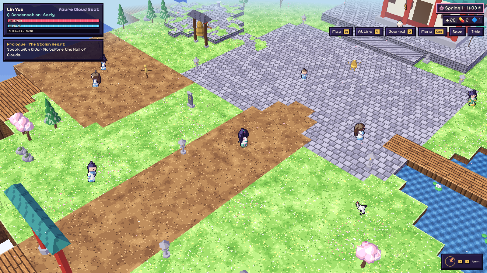 | 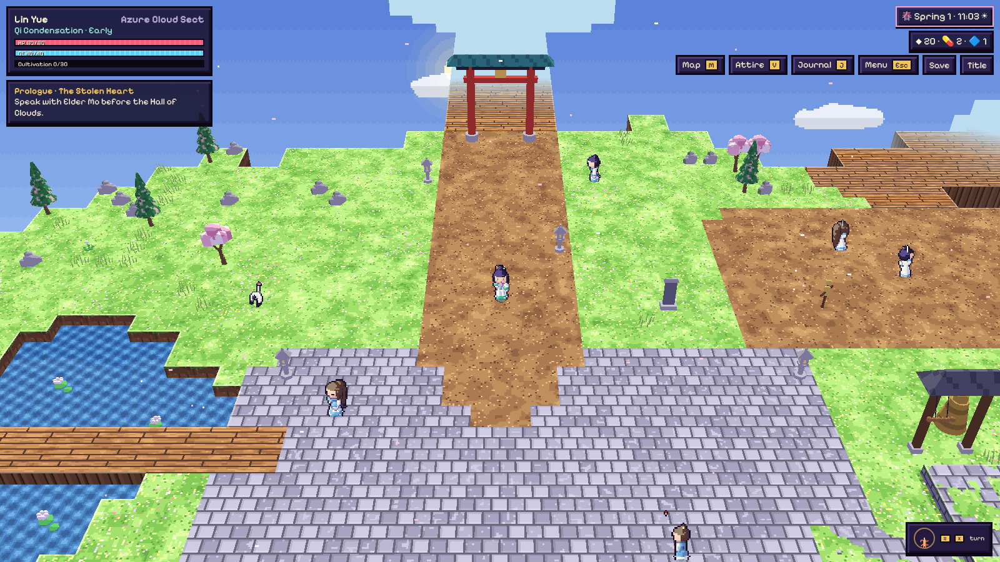 |
| 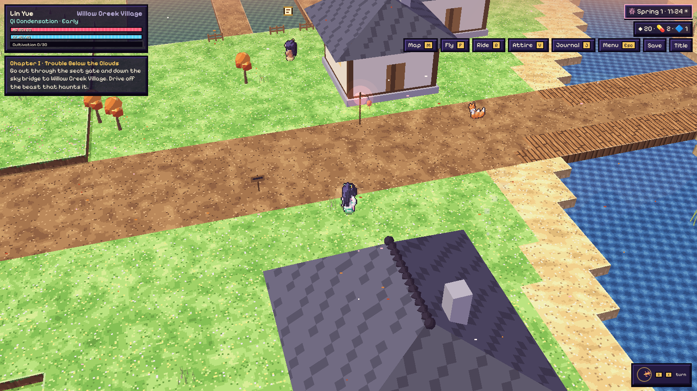 | 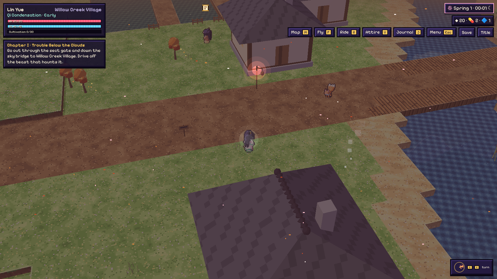 |
| 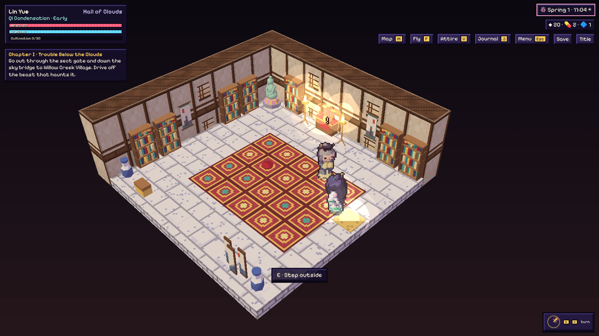 | 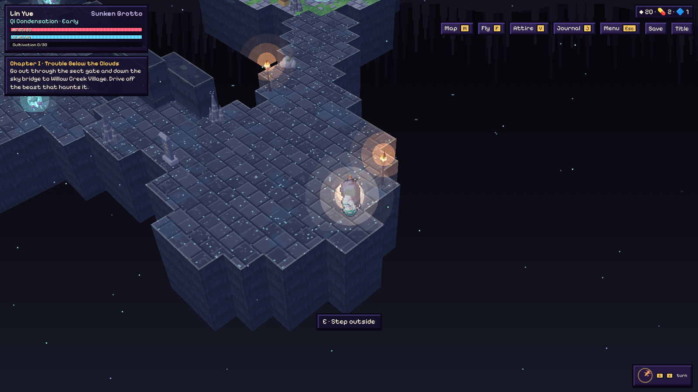 |
| 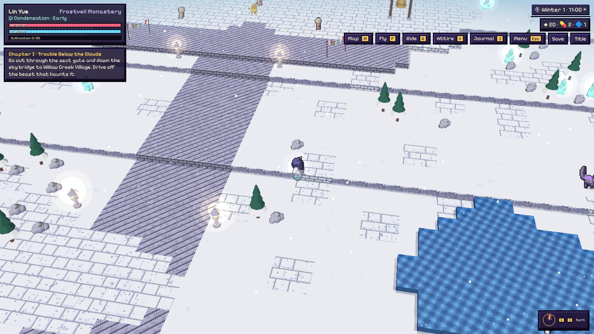 | 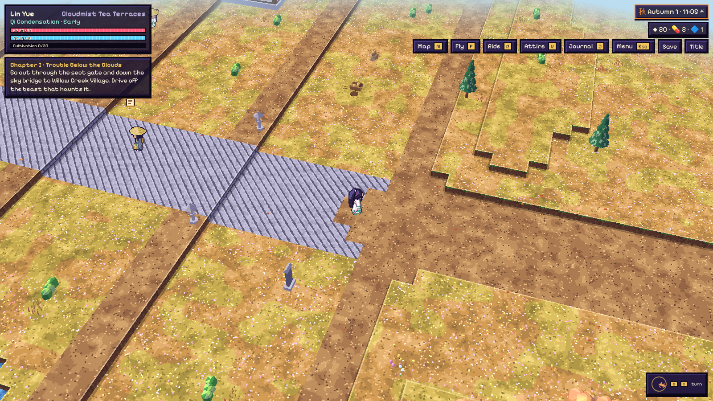 |

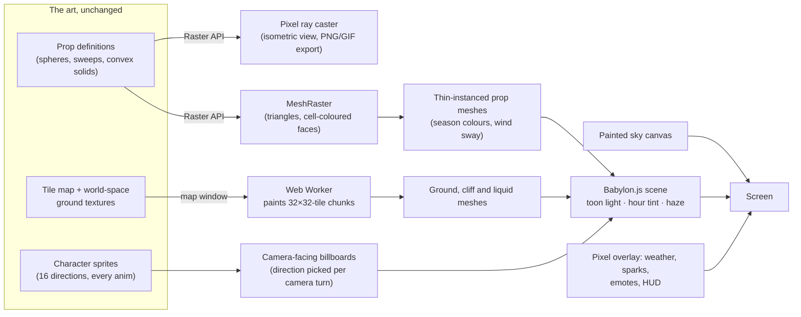
```mermaid
flowchart LR
  subgraph art["The art, unchanged"]
    P["Prop definitions<br/>(spheres, sweeps, convex solids)"]
    T["Tile map + world-space<br/>ground textures"]
    C["Character sprites<br/>(16 directions, every anim)"]
  end
  P -- "Raster API" --> RC["Pixel ray caster<br/>(isometric view, PNG/GIF export)"]
  P -- "Raster API" --> MR["MeshRaster<br/>(triangles, cell-coloured faces)"]
  MR --> TI["Thin-instanced prop meshes<br/>(season colours, wind sway)"]
  T -- "map window" --> W["Web Worker<br/>paints 32×32-tile chunks"]
  W --> CH["Ground, cliff and liquid meshes"]
  C --> BB["Camera-facing billboards<br/>(direction picked per camera turn)"]
  TI & CH & BB --> S["Babylon.js scene<br/>toon light · hour tint · haze"]
  SKY["Painted sky canvas"] --> V["Screen"]
  S --> V
  OV["Pixel overlay: weather, sparks,<br/>emotes, HUD"] --> V
```

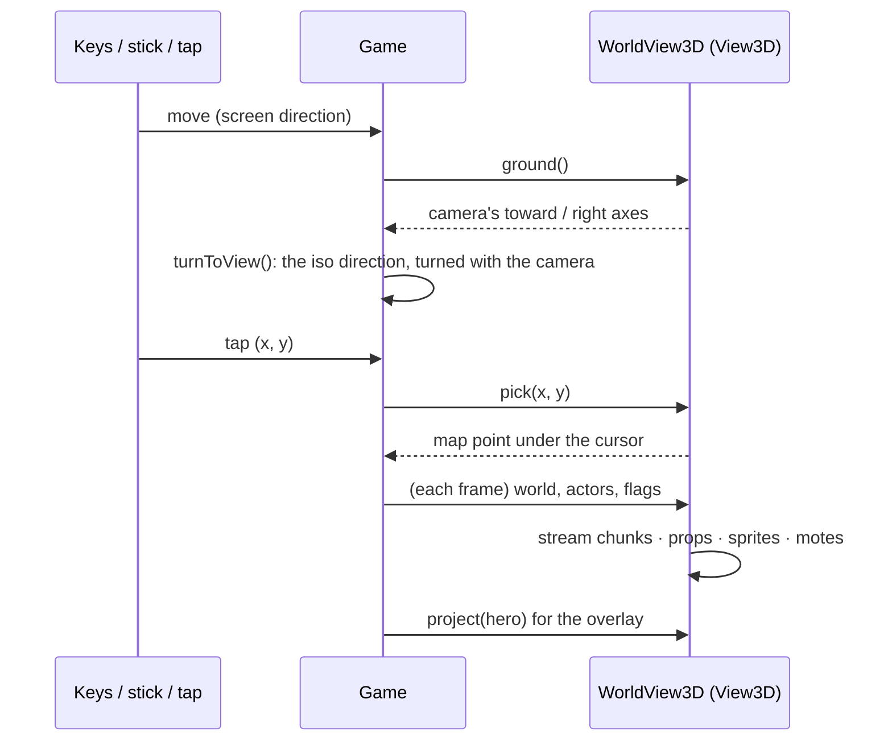
```mermaid
sequenceDiagram
  participant K as Keys / stick / tap
  participant G as Game
  participant V as WorldView3D (View3D)
  K->>G: move (screen direction)
  G->>V: ground()
  V-->>G: camera's toward / right axes
  G->>G: turnToView(): the iso direction, turned with the camera
  K->>G: tap (x, y)
  G->>V: pick(x, y)
  V-->>G: map point under the cursor
  G->>V: (each frame) world, actors, flags
  V->>V: stream chunks · props · sprites · motes
  G->>V: project(hero) for the overlay
```

### The game menu

Press `Esc` or `Tab` (or **Menu**) for the game menu. The world goes on around her while it is open, but she stays put and goes through her satchel.

- **Status**: realm, vitality, qi, attack, defence, speed, Dao Heart, Great Daos, attire, notices and time played.
- **Skills**: each technique she has learned, its qi cost and its key.
- **Bag**: pills (use them from here), spirit stones, and her keepsakes. These follow the tale, so the Jade Lotus Heart shows as carried, returned, planted or drunk depending on what she did with it.
- **Bestiary**: every beast and foe she has fought, with its sprite, strength, signature move, where it roams and how many times she has bested it.
- **People**: everyone she has spoken with, by portrait.
- **Places**: the eleven regions, which are open, and why the sealed ones are sealed.
- **Settings**: 3D or isometric pixels, 3D detail (chunky, crisp, smooth), the compass, camera drag.
- **Controls**: every key.

| | |
|---|---|
| 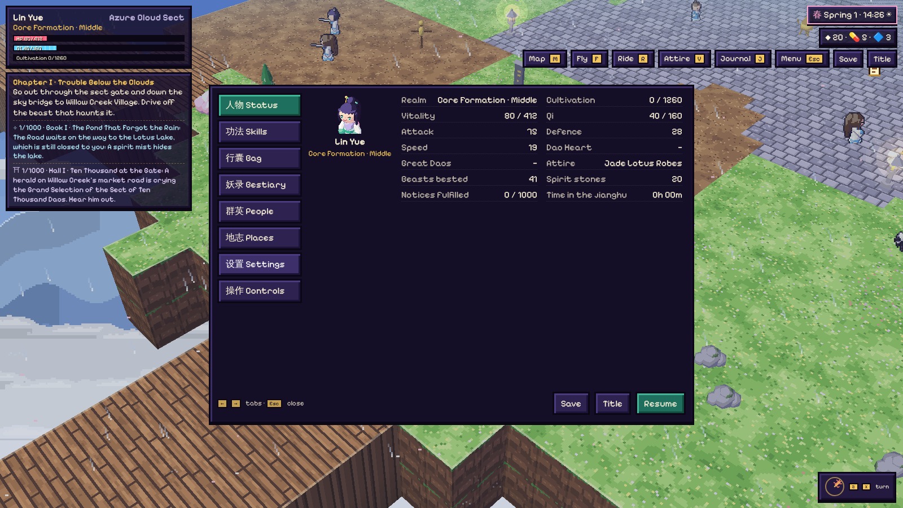 | 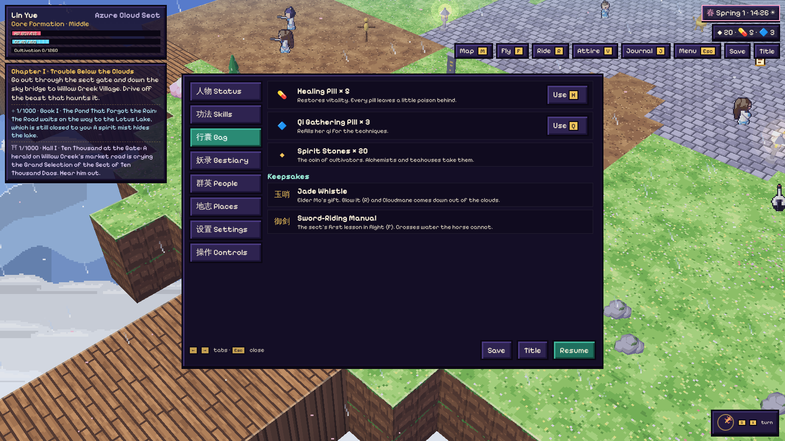 |
| 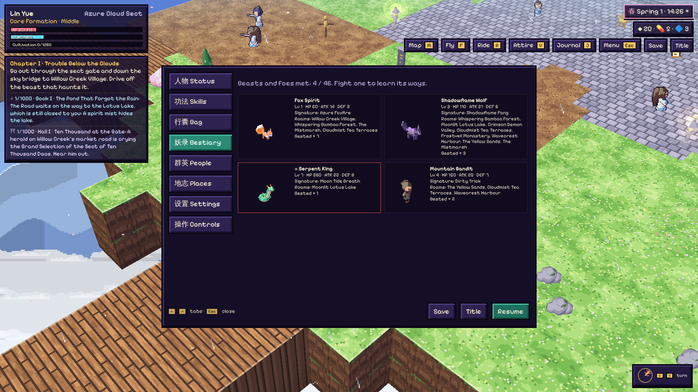 | 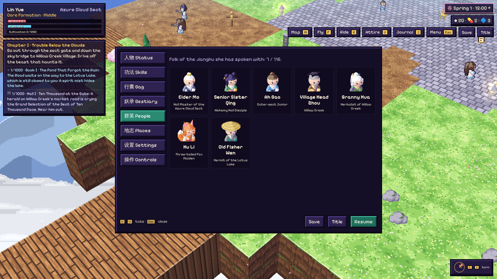 |
| 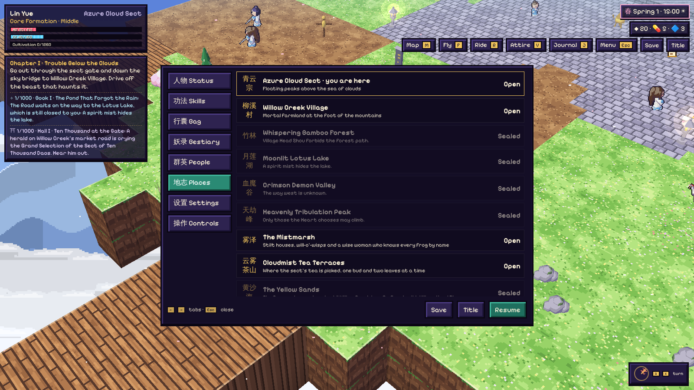 | 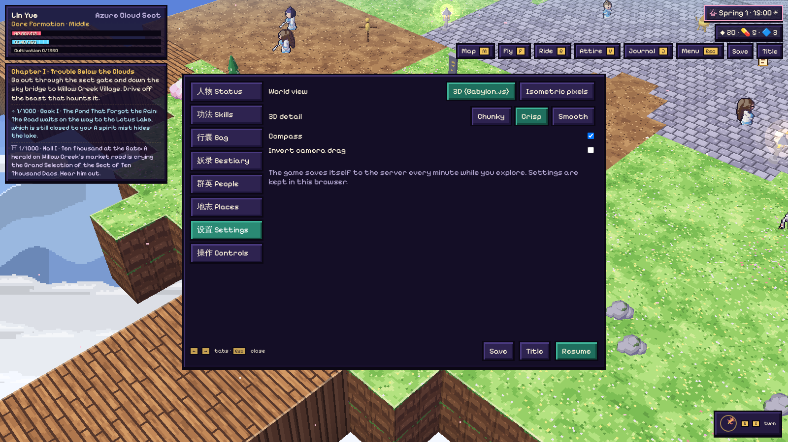 |

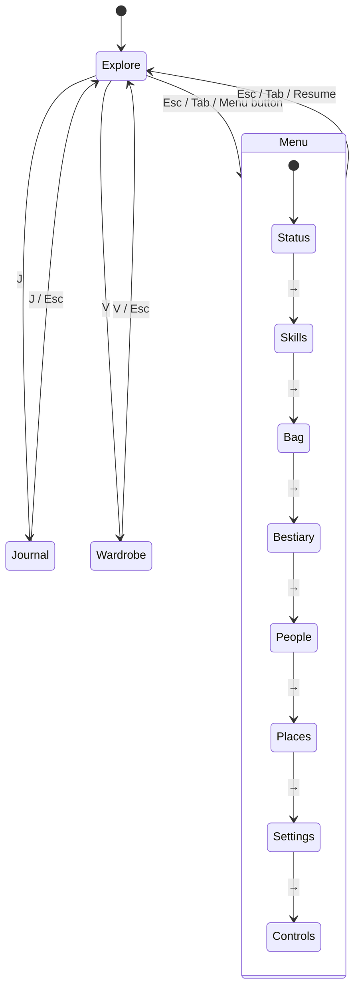
```mermaid
stateDiagram-v2
  [*] --> Explore
  Explore --> Menu: Esc / Tab / Menu button
  Menu --> Explore: Esc / Tab / Resume
  state Menu {
    [*] --> Status
    Status --> Skills: →
    Skills --> Bag: →
    Bag --> Bestiary: →
    Bestiary --> People: →
    People --> Places: →
    Places --> Settings: →
    Settings --> Controls: →
  }
  Explore --> Journal: J
  Explore --> Wardrobe: V
  Journal --> Explore: J / Esc
  Wardrobe --> Explore: V / Esc
```

New moves: Lin Yue **rummages** in her satchel when the menu opens and **shades her eyes** at each new landmark, and folk with a favour to ask **beckon** her over from a little way off.

| Rummage, shade and beckon |
|---|
| 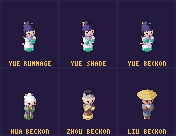 |

**Plot holes mended**

- After she drinks the Jade Lotus Heart, Elder Mo no longer congratulates her on her new realm moments before he duels her for it. He also keeps his pointers and his worries to himself until the duel is settled.
- Once she has broken his cultivation, Elder Mo is a mortal: he no longer "feels" her golden core from across the hall. He gives no more cultivation pointers, and his lines speak of the broom and the scorched marble.
- If she turned back from heaven's stair (the Guardian or Road Home endings), Elder Mo no longer thanks her for "coming back down" from a heaven she never entered.
- A foundling who runs up the sky bridge before facing the fox is no longer greeted for the "fox blood on her sleeve", or told she has "already met" the beast.


### The grand halls of the sects: three storeys, no loading, and quests that walk

The sects build big. Two **grand halls** now stand in the open world, each three storeys high with **well over a thousand tiles of floor** (about 1,700 in each), and neither is a separate room you load into. You walk through the door, and the building opens up around you in the same world, with the same sky and the same folk walking past outside.

- **The Pavilion of Drifting Scriptures** (藏经阁), the Azure Cloud Sect's library, on its own isle moored east of the sect and reached by a plank walk from the Cloudstep Isles: **the Lecture Hall** (Master Lu on the dais and rows of disciples taking notes, chanting, or dozing and calling it meditation), **the Stacks** (five long rows of shelves, copyists, an ink grinder, the keeper re-shelving, a scroll runner on his rounds) and **the Starwatch Gallery** under the roof (Elder Xi, the ten lamps, a bell, and a sealed case of sutras marked “Not yet”).
- **The Hall of Ten Thousand Debates** (万论堂), outside the Ten Halls' south gate with its door on the road: **the Refectory** (cooks at the steamers, three long tables of disciples eating and arguing, servers with trays), **the Debating Floor** (a ring of debaters round the Arbiter, a gong to begin and a drum to stop, a clerk writing down every word) and **the Furnace Loft** (a furnace, cauldrons, fanners, talisman writers).

| | |
|---|---|
| 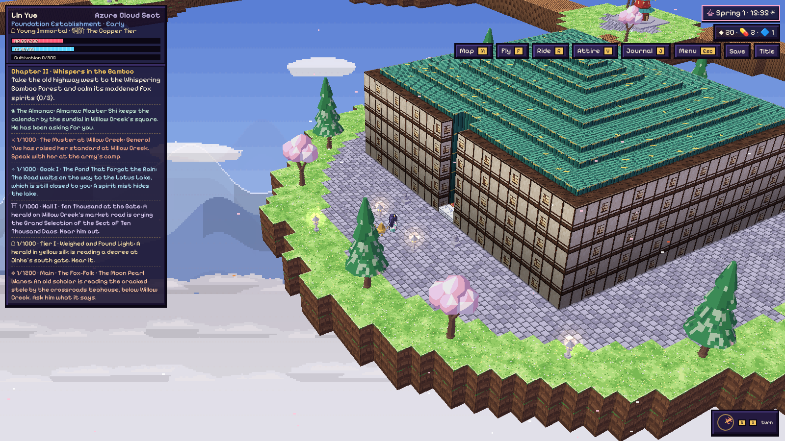 | 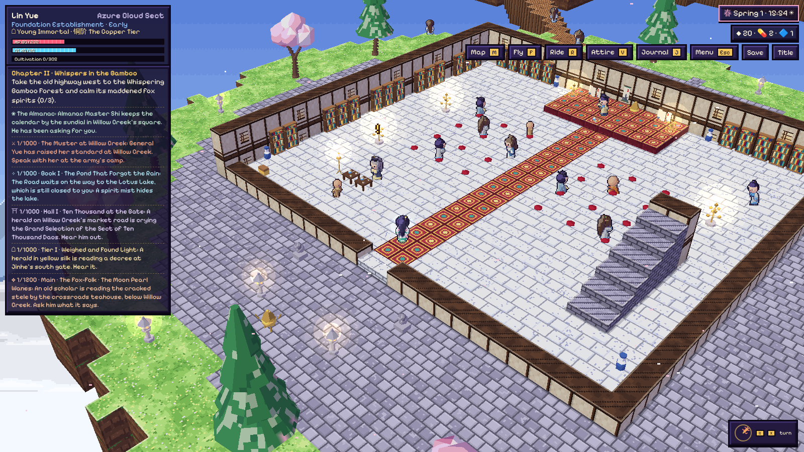 |
| 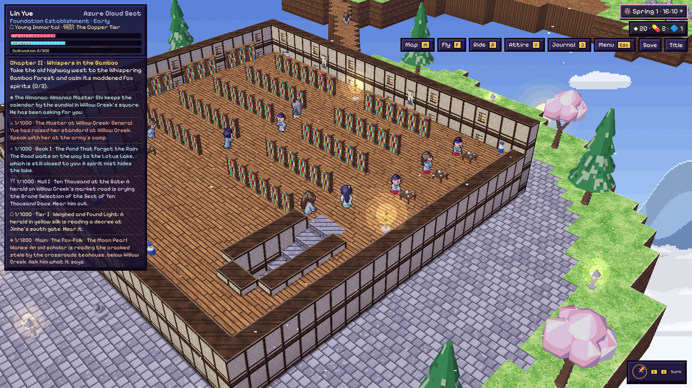 | 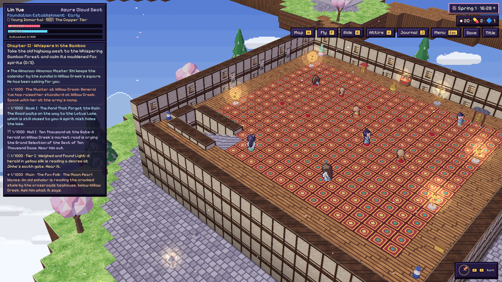 |
| 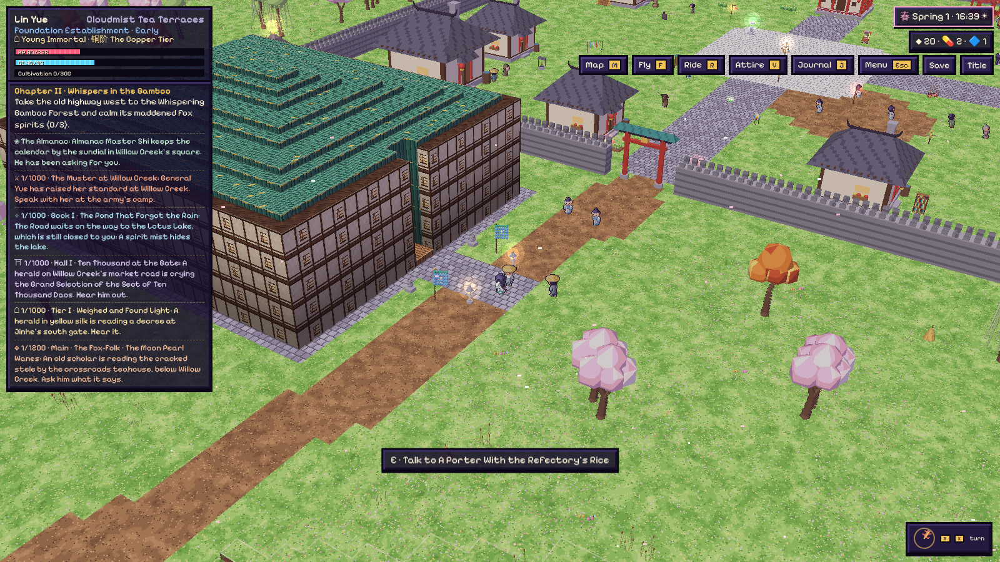 | 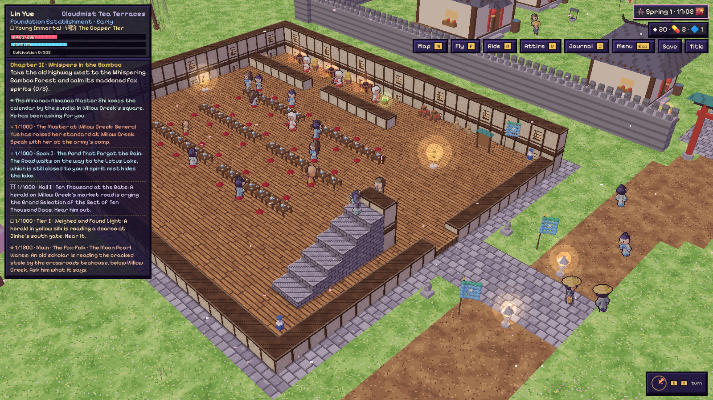 |
| 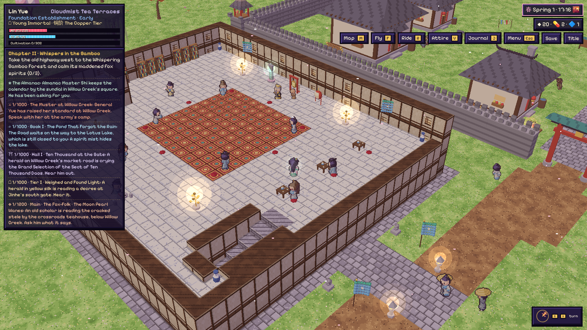 | 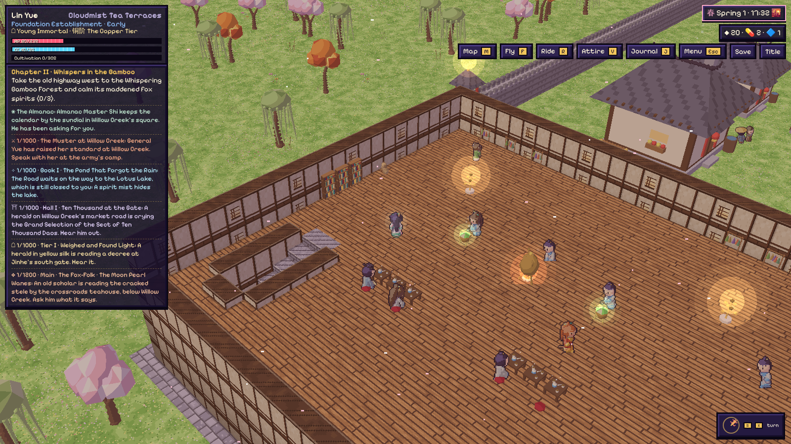 |

#### Showing and hiding instead of loading

A hall's footprint in the world map has four states: the **shell** (plastered walls as tall as all three storeys, lattice windows, and a stepped roof of jade-green glazed tiles, the new `roof` tile) and **one state for each storey**. From outside you see the shell. Step into the doorway and the footprint swaps to the ground floor: the roof and upper storeys go, the back walls stay at full height and the front walls drop to a sill, so the camera looks in like a doll's house. Each storey's furniture, folk and things to read are tied to a `hall:<key>:<n>` flag, so only the storey you're on is shown.

The **stairs are real stairs**, one level per step, and they are the same tiles on the storey below and the storey above. Near the top of a flight, the floor above replaces the floor below; near the bottom, the reverse. There's no fade or teleport. In 3D only the ground chunks under the hall are repainted, and the old ground stays up until the new ground is ready. The isometric pixel view throws away only the painted columns that changed.

| | |
|---|---|
| 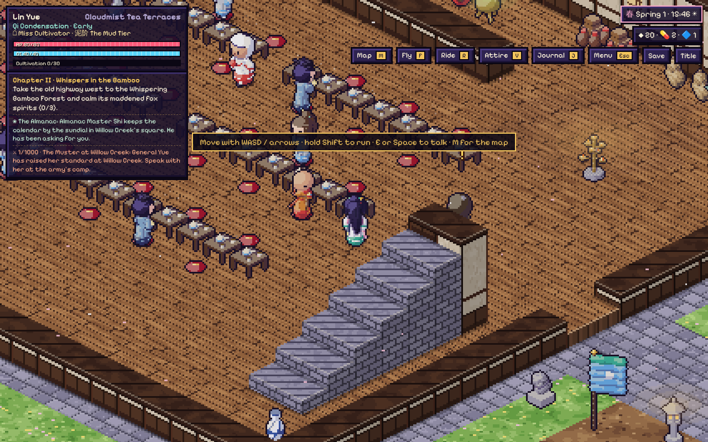 | 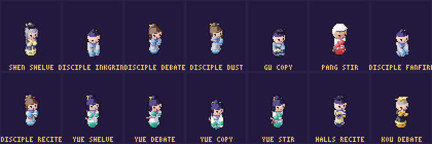 |

#### Quests that walk

The two halls hold over sixty residents, and some of them won't stand still: a sweeper, the tea girl, servers, a mopper, a scroll runner, a porter of herbs and a pacing debater walk their rounds, and disciples come and go along the plank walk and the south road. Two new side quests send you up and down the stairs after people on the move:

- **Three Overdue Scrolls**: Librarian Wen wants three scrolls back from three borrowers, one walking laps of each floor of the pavilion.
- **The Relay of Answers**: Steward Pan's question from the refectory has to go up to **Debater Ji, who argues walking**, then up again to **Furnace Master Rong**, who answers by burning things, and then back down before the congee gets cold.

Both show in the journal while they're under way, and every step is a story flag, so old saves load unchanged.

#### 8 new animations

`shelve` (up on her toes to slide a scroll onto the top shelf), `inkgrind`, `debate` (a jab, a palm slapped into a palm, a shake of the head), `dust` (with a sneeze at the end of the row), `copy`, `stir`, `fanfire` (with a cough) and `recite`. The outer disciples also pick up eating, laughing, writing and meditating, and Lin Yue can shelve, grind ink, debate, copy and stir too.

### The Hundred Peoples: six peoples, six homes, 1200 new main and side quests, and twice the draw distance

The jianghu is not only human. **Six other peoples** now keep homes of their own out in the wilds, each with its own look, its own customs, its own elder and guide, its own folk going about their own work, and its own grief. Three hundred years ago the **Concord of a Hundred Peoples** (百族盟), the oath that kept them and the human jianghu from one another's throats, cracked on the night of the **Purge of Strange Blood**. Its cracked stone stands by the crossroads teahouse below Willow Creek, and **Envoy Shan**, its last keeper, gives Lin Yue its tally to carry from home to home.

This is the seventh thread of the tale: **1200 quests in six books of 200, one for each people**. Each book is its own story, told in **10 hand-written beats** (60 in all, 19 with a question answered four ways) and **20 rites** of the home: those, the wait for her realm and the trouble at the end are its **main quests** (192 in all). Between them runs the life of the home as **side quests** (1008 in all): the folk's favours, goods carried between peoples who have not traded since the Purge, tales of the peoples carried to the human jianghu, hunts in the wilds round each home, sittings at its shrine and walks to its places. The HUD and the journal mark each quest **Main** or **Side**.

| Book | People | Home | Their custom | Its trouble |
| --- | --- | --- | --- | --- |
| I · 月珠渐亏 The Moon Pearl Wanes | 狐族 the Fox-Folk | 月狐谷 Moonfox Hollow, in the maple woods | a fox may trick you, never lie to you; debts are paid in stories | Hu Yan, the Moon-Eater |
| II · 泣珠成泪 Tears Like Pearls | 鲛人 the Merfolk | 珠歌礁 Pearlsong Reef, on the eastern shore | their tears fall as pearls; their sea-silk is given, never sold | Chen Yuan, the Drowned Prince |
| III · 长眠 The Long Sleep | 石人 the Stone-Born | 空石堡 Hollowstone Hold, in the red sands | they sleep a hundred years at a time and carve every memory into their skin | Kuang Yan, the Hollow King |
| IV · 初羽 The First Feather | 羽民 the Feathered Folk | 羽天巢 Skyfeather Eyrie, in the plum hills | a child is named only when it earns its flight feather | Lie Feng, Lord of the Storm |
| V · 不灭之炉 The Hearth That Never Goes Out | 雪民 the Snow-Folk | 霜角寨 Rimehorn Lodge, in the snowfields | a guest is sacred for three nights; winters are counted in knots | Kar, the White Hunger |
| VI · 龙骨苏醒 Wake the Bones | 龙裔 the Dragon-Kin | 烬鳞城 Emberscale Hold, in the red badlands | they hoard knowledge, not gold; a shed scale is a debt of fire | Ao Kuang the Unbound |

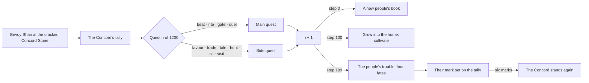
```mermaid
flowchart LR
  E[Envoy Shan at the cracked Concord Stone] --> T[The Concord's tally]
  T --> Q{Quest n of 1200}
  Q -->|beat · rite · gate · duel| M[Main quest]
  Q -->|favour · trade · tale · hunt · sit · visit| S[Side quest]
  M --> N[n + 1]
  S --> N
  N -->|step 0| B[A new people's book]
  N -->|step 100| G[Grow into the home: cultivate]
  N -->|step 199| D[The people's trouble: four fates]
  D --> K[Their mark set on the tally]
  K -->|six marks| C[The Concord stands again]
```

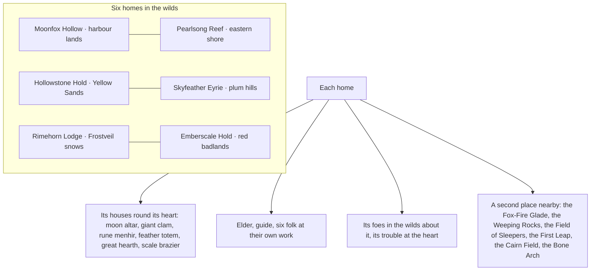
```mermaid
flowchart TB
  subgraph Homes[Six homes in the wilds]
    F[Moonfox Hollow · harbour lands] --- M[Pearlsong Reef · eastern shore]
    ST[Hollowstone Hold · Yellow Sands] --- FE[Skyfeather Eyrie · plum hills]
    SN[Rimehorn Lodge · Frostveil snows] --- DR[Emberscale Hold · red badlands]
  end
  H[Each home] --> P[Its houses round its heart: moon altar, giant clam, rune menhir, feather totem, great hearth, scale brazier]
  H --> R[Elder, guide, six folk at their own work]
  H --> W[Its foes in the wilds about it, its trouble at the heart]
  H --> L[A second place nearby: the Fox-Fire Glade, the Weeping Rocks, the Field of Sleepers, the First Leap, the Cairn Field, the Bone Arch]
```

| | |
|---|---|
| 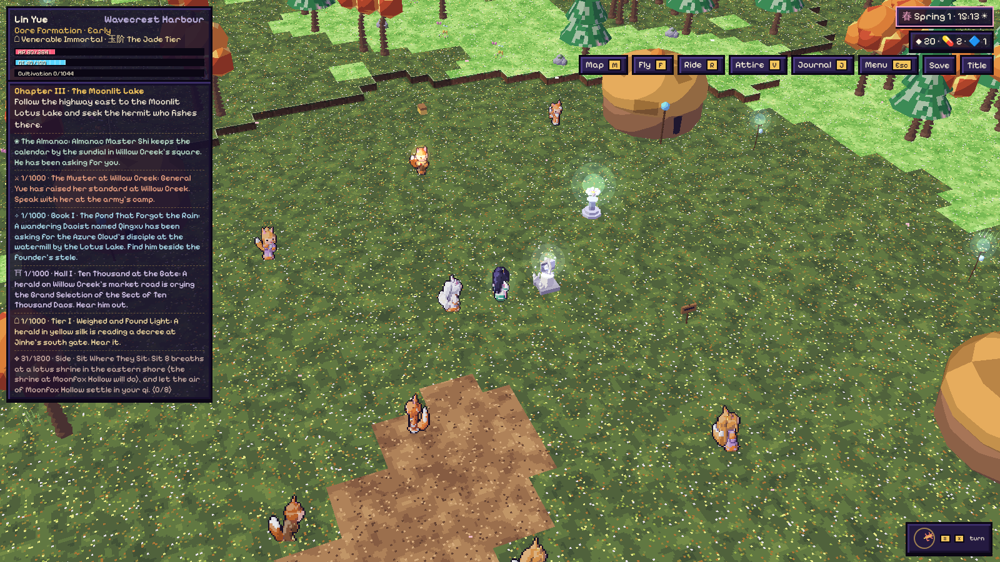 | 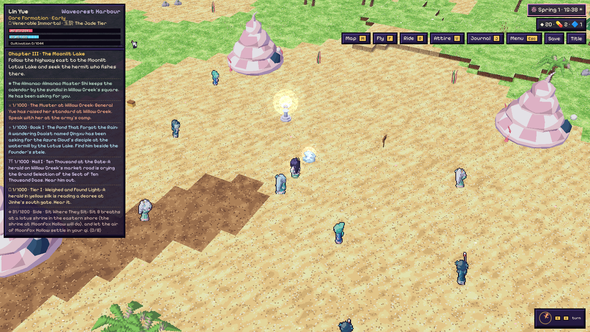 |
| 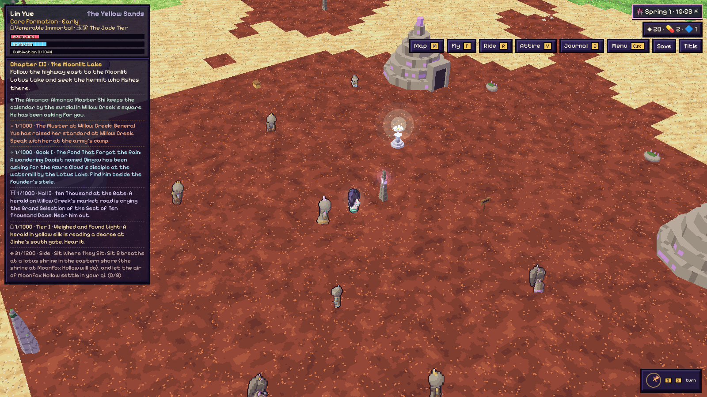 | 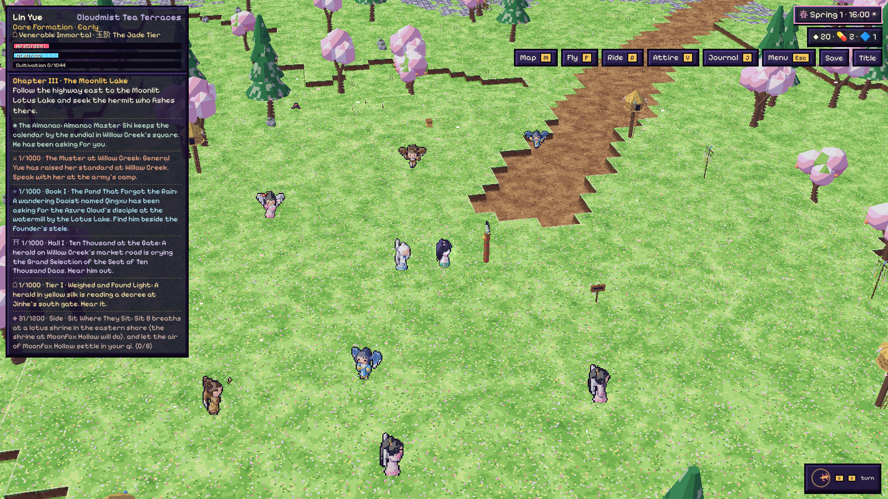 |
| 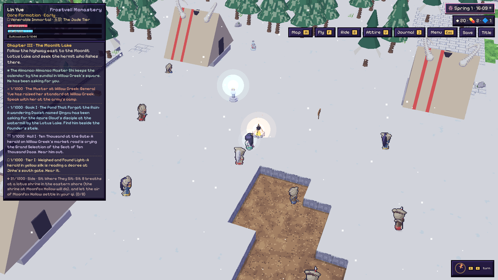 | 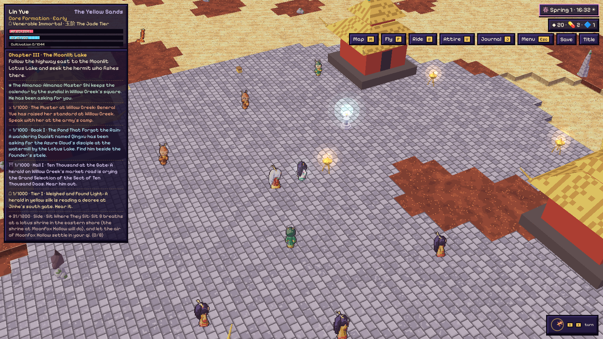 |
| 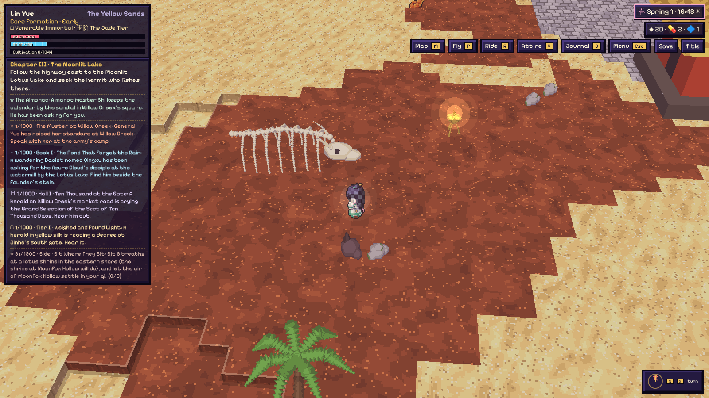 | 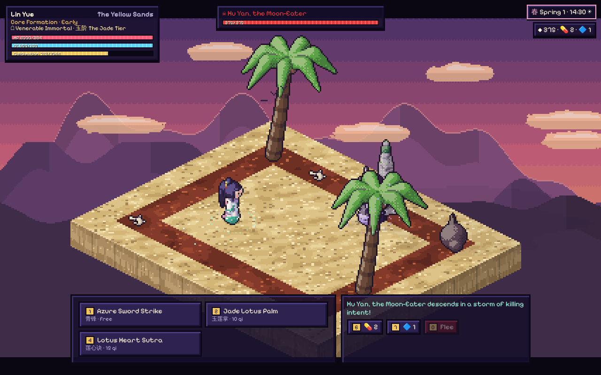 |
| 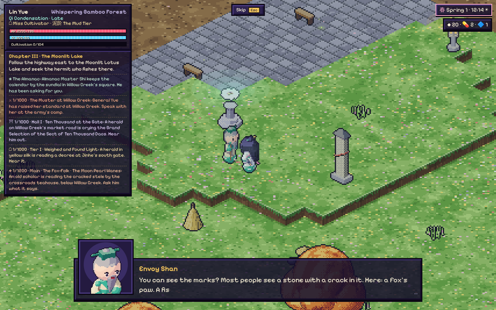 |  |
| 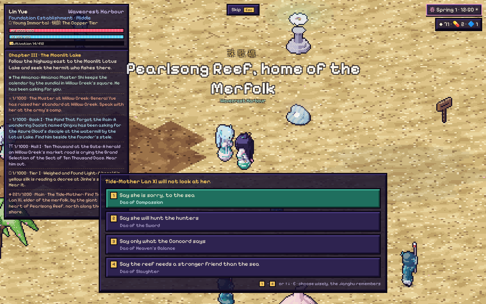 | 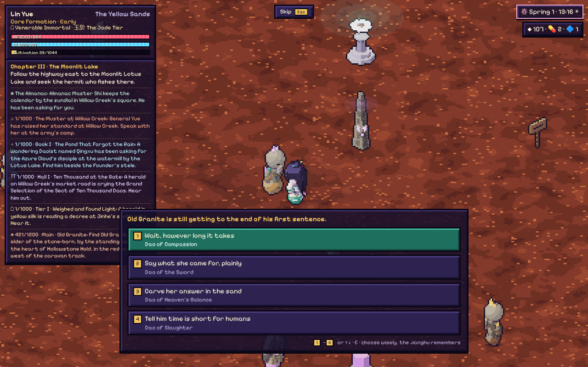 |
| 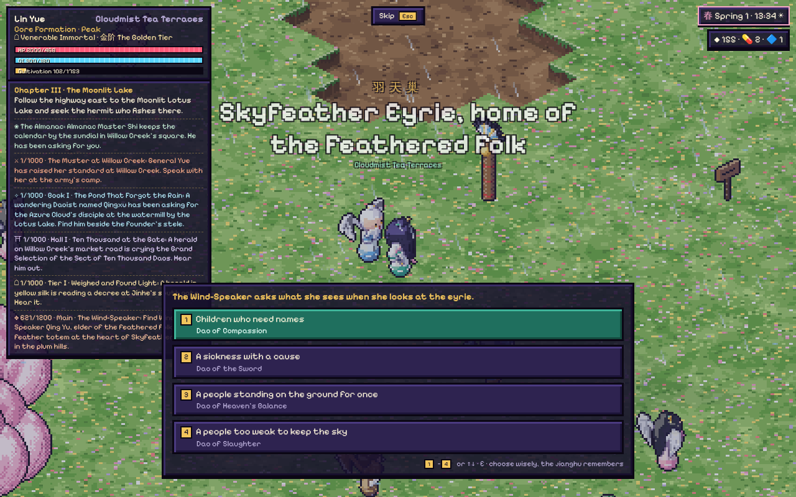 | 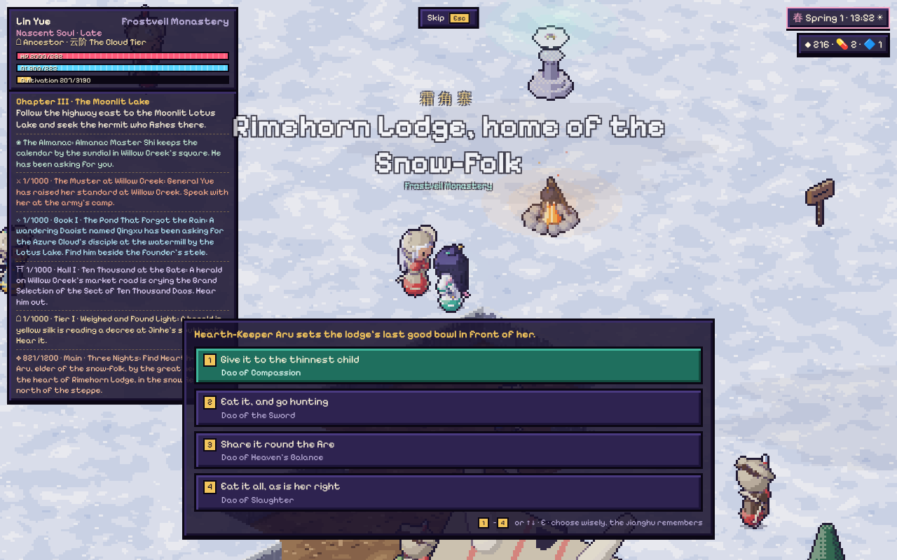 |
| 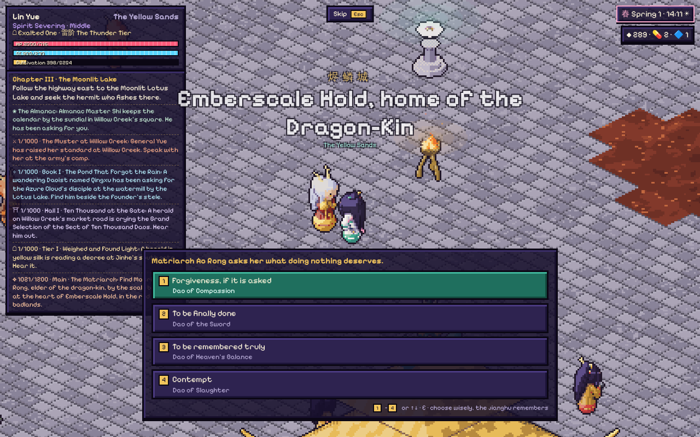 | 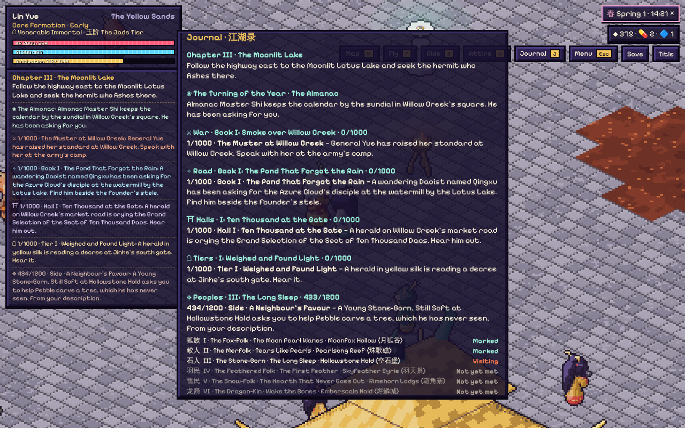 |

#### Twice the draw distance

The 3D view now draws the land **twice as far**: terrain chunks load out to 128 tiles from the camera (dropped beyond 200), props stand out to 116 tiles, folk and beasts are drawn out to 120, smoke and petals rise twice as far off, and the haze starts and closes in twice as far away. The camera's far plane doubled, it zooms out twice as far (`−` or the wheel, up to radius 96), a third worker paints the ground, and the folk keep living (and the marks over their heads keep showing) twice as far from her.

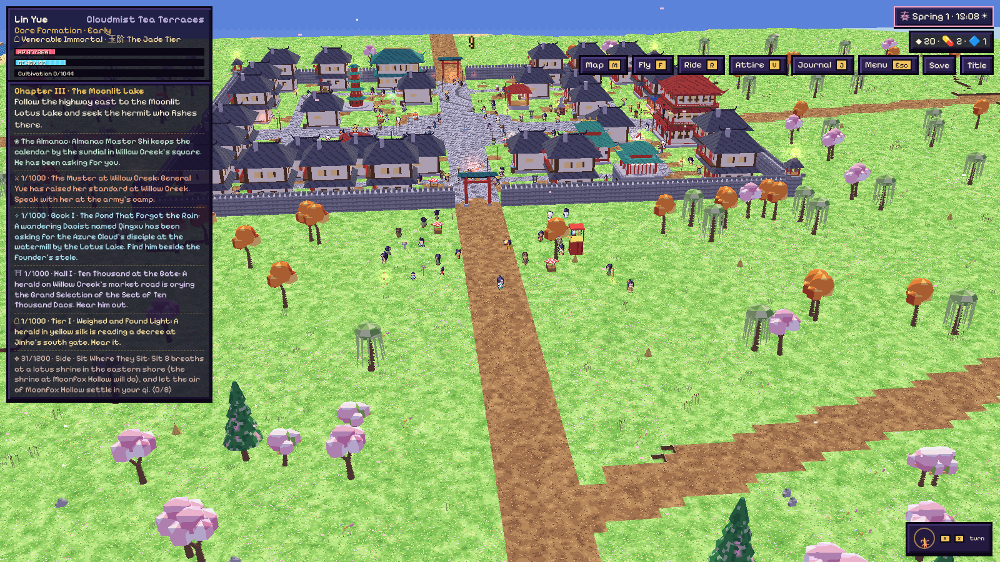

#### 18 new 3D props, 31 new characters and 8 new animations

- **Props** (each drawn as pixel art and built as a 3D model from the same solids): the fox den, moon altar and fox-fire lantern; the shell-spiral coral house, giant pearl clam and swaying kelp; the beehive stone hut, rune menhir whose runes light in turn, and a sleeping stone-born under moss; the pole-top eyrie, bone wind-chime and feather totem; the horn lodge with its smoking hearth-hole, ice cairn and the great hearth that has burned nine hundred winters; the scale-roofed dragon hall, the bones of the last great dragon and the clawed scale brazier; and the cracked Concord Stone.
- **Characters**: an elder, a guide, two kinds of folk and a trouble for each people, and Envoy Shan. The rig grew four new marks: **dragon or ram's horns, feathered wings that beat with her breath, ear-fins and a dorsal crest, and crystal shards** (the fox-folk keep their ears and tails).
- **Animations**: the fox-folk's **moon dance**, the merfolk's **weeping**, the stone-born's **carving**, the feathered folk's **glide**, the dragon-kin's **fire-breath**, the snow-folk's **knot-counting** and **hearth song**, and a token **offered on an open palm**. Lin Yue learns the moon dance, the glide, the hearth song, carving and the offering among them.

### The City of Nine Tiers: a thousand more main quests, a town and a city twice the size, and a jianghu that weighs her realm

Across a strait of cloud south of Jinhe stands **天阶城 Tianjie, the City of Nine Tiers**: a whole mountain cut into nine terraces round a summit. Its law is the **Stair Code (阶律)**: *as a cultivator stands, so may she stand.* Each realm earns a tier and each tier has a gate. Below the gate, a word weighs what its speaker weighs. Mortals carry for everyone on the Mud Tier at the city's foot. Every spring the **Weighing Hall** weighs them on a great steelyard, and the ones found light go to the sleeping house and do not wake. Their years run up the mountain into the **Stair Array**, which holds the city up. The Sovereign of the Stair means to fill the Array at the next conjunction and lift the whole city into heaven.

This is the sixth thread of the main tale: **1000 quests in ten books, one for each tier and the summit**, each book its own story told in hand-written beats (110 of them, 20 with a question answered four ways). Lin Yue is weighed and given a jade tablet. She climbs the city with **Ah Lou**, a fourteen-year-old porter whose father was weighed light, and **Registrar Wen Qi**, a clerk who has begun to read the second column of his own ledgers.

| Book | Tier | Her tablet must read | The tale | Its trouble |
| --- | --- | --- | --- | --- |
| I · 称骨 Weighed and Found Light | 泥阶 the Mud Tier | Qi Condensation, late | the porters, the sleeping house, the porters' strike | Overseer Kuang |
| II · 铜债 The Debt of Copper | 铜阶 the Copper Tier | Foundation Establishment | pills priced in years, a bonded smith's bottleneck | Guildmaster Tong, the Debt-Smith |
| III · 假牌 The Forged Tablet | 银阶 the Silver Tier | Foundation, late | Faceless Liu forges Silver tablets for mortal children | Inquisitor Sima |
| IV · 红线 The Red Thread | 玉阶 the Jade Tier | Core Formation | a Jade daughter promised to a 460-year-old elder | Madam Qiao of the Red Thread |
| V · 挑战律 The Law of Challenge | 金阶 the Golden Tier | Core, late | clans hire champions so no challenge is ever won | Lei Ba, Champion (a bout) |
| VI · 言重 The Weight of a Word | 紫阶 the Violet Tier | Nascent Soul | testimony weighed by realm, and a mortal's weighs nothing | Justiciar Yan Heng |
| VII · 借春 A Thousand Borrowed Springs | 云阶 the Cloud Tier | Nascent Soul, late | the Year Market, where elders buy porters' springs | Elder Mei Shou, Eater of Years |
| VIII · 星命 The Chart of Every Child | 星阶 the Star Tier | Spirit Severing | every child's tier written at birth, and the conjunction | Star-Registrar Qu Xing |
| IX · 无后 Nothing Behind Me | 雷阶 the Thunder Tier | Spirit Severing, middle | the Severed Guard, and Ah Lou's mother | Lou Feng, Captain of the Ninth Gate |
| X · 天阶 Heaven's Step | the summit | Spirit Severing, late | the Sovereign's Ascent, and the great beam under the palace | Gao Qiong, Sovereign of the Stair |

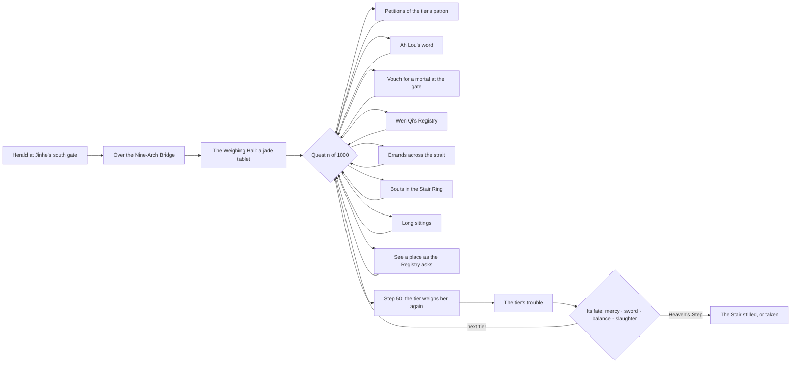
```mermaid
flowchart LR
  H[Herald at Jinhe's south gate] --> B[Over the Nine-Arch Bridge]
  B --> W[The Weighing Hall: a jade tablet]
  W --> Q{Quest n of 1000}
  Q --> P[Petitions of the tier's patron]
  Q --> A[Ah Lou's word]
  Q --> V[Vouch for a mortal at the gate]
  Q --> R[Wen Qi's Registry]
  Q --> E[Errands across the strait]
  Q --> C[Bouts in the Stair Ring]
  Q --> S[Long sittings]
  Q --> L[See a place as the Registry asks]
  P & A & V & R & E & C & S & L --> Q
  Q --> G[Step 50: the tier weighs her again]
  G --> T[The tier's trouble]
  T --> F{Its fate: mercy · sword · balance · slaughter}
  F -->|next tier| Q
  F -->|Heaven's Step| X[The Stair stilled, or taken]
```

**The gates answer to her realm, not to the tale.** Each tier is a terrace two levels above the one below it, so every terrace wall is a cliff and only the avenue's stairs climb them. At the head of each stair stands a gate, its warden at the foot, and a curtain of gold light that will not part for anyone below the tier's realm, on foot or on a sword. A Qi Condensation girl can only walk the Mud Tier. A Spirit Severing cultivator who arrives late in her story can walk straight up to Heaven's Step, though its people will not deal with her until the tale reaches them. The bars are new world data (`WorldDef.bars`) that the runtime checks as she moves, and the toast tells her what her tablet reads and what the seal wants.

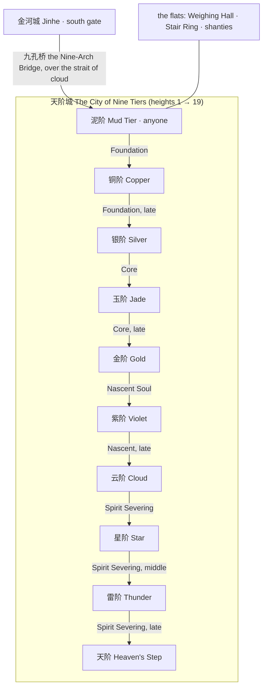
```mermaid
flowchart TB
  subgraph city["天阶城 The City of Nine Tiers (heights 1 → 19)"]
    mud["泥阶 Mud Tier · anyone"] -->|"Foundation"| copper["铜阶 Copper"]
    copper -->|"Foundation, late"| silver["银阶 Silver"]
    silver -->|"Core"| jade["玉阶 Jade"]
    jade -->|"Core, late"| gold["金阶 Gold"]
    gold -->|"Nascent Soul"| violet["紫阶 Violet"]
    violet -->|"Nascent, late"| cloud["云阶 Cloud"]
    cloud -->|"Spirit Severing"| star["星阶 Star"]
    star -->|"Spirit Severing, middle"| thunder["雷阶 Thunder"]
    thunder -->|"Spirit Severing, late"| step["天阶 Heaven's Step"]
  end
  jinhe["金河城 Jinhe · south gate"] -->|"九孔桥 the Nine-Arch Bridge, over the strait of cloud"| mud
  flats["the flats: Weighing Hall · Stair Ring · shanties"] --- mud
```

| | |
| --- | --- |
| 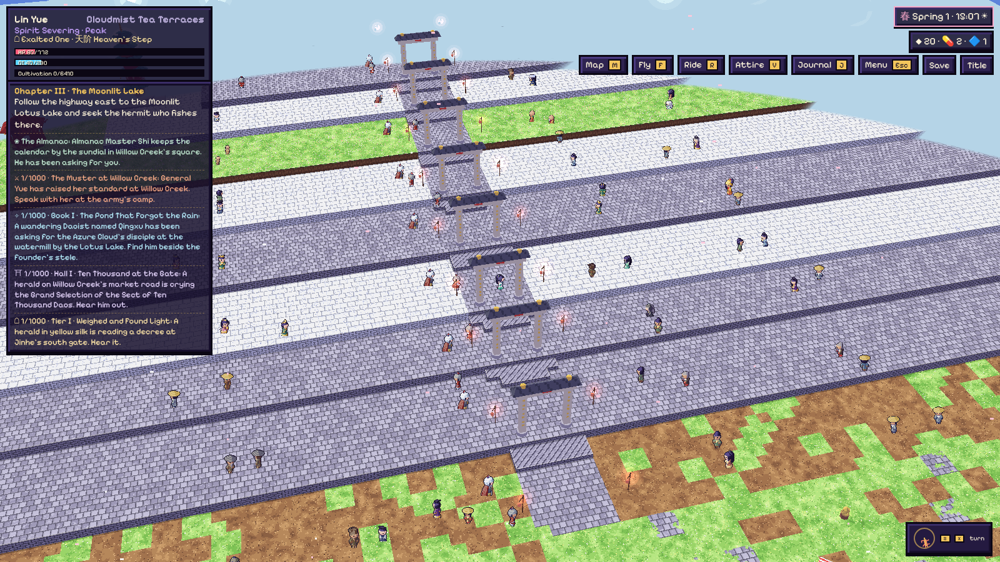 | 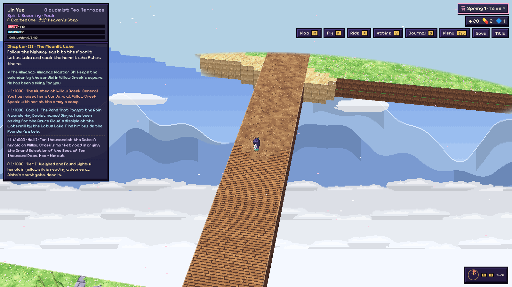 |
|  |  |
|  |  |
|  |  |
|  |  |
|  |  |

- **Every quest is composed from its number**, as the other threads are, so the save holds only `tiers` and `tiersp`. The flags the city answers to (`tiers:gate:<k>`, `tiers:book:<k>`, `tiers:boss:<k>`, `tiers:fate:<k>:<dao>`) are derived from those and from her realm.
- **Ah Lou and Wen Qi climb with her.** One of each stands on the tier of the book she is on. Ah Lou is mortal and climbs as Lin Yue's bearer, vouched for at every gate.
- **Ten troubles and their fates.** Each tier's tale ends with a fight and a choice that leans her Dao Heart. The last one decides the city: let the Array go and the city sink to the land, re-carve the Stair Code, cut the great beam in two, or take the city for herself.
- **Outfits:** the Porter's Blue Jacket (500 quests, sewn by the Mud Tier), and at the end the Robe of Heaven's Step, or the Robe of the Stair's Throne. The ending has a line for the city.

#### 身份 Standing: what her realm makes her

Her realm is no longer a private matter. It changes how the whole jianghu treats her.

- **Forms of address.** Mortals call her *Miss Cultivator*, then *Young Immortal*, *Venerable Immortal*, *Ancestor*, *Exalted One* and *Heavenly Immortal*. Cultivators call her *Junior Sister*, *Fellow Daoist*, *Senior*, *Senior Ancestor*. Lines everywhere fill these in (`{title}`, `{peer}`, `{realm}`, `{tier}`). The HUD shows her standing under her realm, and the journal has a Standing page.
- **The folk notice.** All of the jianghu's ordinary folk now speak to her realm as well as their own lives: a farmer asks a Foundation cultivator to stand in his paddy, a sect disciple calls a golden core *Senior* and begs a pointer, a soldier salutes. From Core Formation a mortal may go down on both knees as she passes, and from Nascent Soul they all do. Cultivators salute instead. If her heart demons show, the mortals back away.
- **Doors open with her realm.** The Pavilion of Nine Fragrances lets only Foundation and above up its stair. The Willow Inn's top floor is kept for Willow Creek's own golden core. In the City of Nine Tiers every gate is her realm's.
- **The new quarters' folk** (48 in Jinhe and Willow Creek, and the inns' guests) each have a line for each realm. Madam Liu of the East Ward, who never looked at the foundling, kneels to the Ancestor. The Grain Guild extends credit to Foundation. The matchmaker's list for a Nascent Soul is very short.

| | |
| --- | --- |
|  |  |
|  |  |
|  |  |


```mermaid
flowchart LR
  R["Her realm"] --> T["What they call her<br/>Miss → Young Immortal → Venerable → Ancestor → Exalted One"]
  R --> K["How they greet her<br/>wave → bow → kneel (mortals) · salute (cultivators)"]
  R --> D["Which doors open<br/>upper floors · the tiers' gates"]
  R --> W["How much her word weighs<br/>vouching at the gates · testimony on the Violet Tier"]
  T & K & D & W --> F["Every folk's lines: crowd chatter, the new quarters, the inns, the tiers"]
```

#### A town and a city twice the size, in storeys

- **Jinhe** has grown past its old walls. A new wall stands a ring further out, with four new watchtowers and gates, and the line of the old wall is now a lane. The new quarters between are built up in storeys: shophouses with balconies over the street, a drum tower, a salt commissioner's long two-storey mansion, the dyers' row, and the **Pavilion of Nine Fragrances**, a three-storey restaurant. It has 26 new townsfolk (bearers with a sedan chair, gossips, a lantern-lighter, a letter-writer, a matchmaker, a blind beggar, the drum-keeper and more), and twice the buildings it had.
- **Willow Creek** has spilled east across its market road into the **East Ward (柳溪东坊)**, as big as the village itself, below the creek. It has a two-storey street, the three-storey **Willow Inn**, the Liu clan's hall, a drum tower, cottages, stalls and 22 new villagers. It is the village's ground outright (`HOLDS` in `world/layout.ts`), though the lake's shore is nearer half of it.
- **Storeys inside too.** The two inns have a floor above. Walk to the stair and press `E` to climb, and walk out of the upper floor's front to come back down. Each upper floor is a room of its own over the same footprint, with no street door, and only her realm opens it.

| | |
| --- | --- |
|  |  |
|  |  |

| Pavilion of Nine Fragrances | Its upper floor | The Willow Inn | Its top floor |
| --- | --- | --- | --- |
|  |  |  |  |

| The East Ward | Jinhe | The City of Nine Tiers | Heaven's Step |
| --- | --- | --- | --- |
|  |  |  |  |


```mermaid
stateDiagram-v2
  [*] --> Street
  Street --> GroundFloor: walk into the door / E
  GroundFloor --> Street: threshold mat
  GroundFloor --> UpperFloor: E at the stair (realm ≥ the house's rule)
  GroundFloor --> GroundFloor: E at the stair, realm too low (“Not up there, miss”)
  UpperFloor --> GroundFloor: the front edge / E (back down the stair)
```

#### The world grew south again

The authoring grid grew from 560 to **660 rows** (the world map is now 1296 × 1320 tiles), and every older position is still the same spot. The Golden River country's south gate road runs on to the cliffs over a strait of cloud. The **Nine-Arch Bridge** crosses it to **the Stairlands**, a new biome of karst pinnacles and terraced green around the city, with the mud flats at its foot, the Weighing Hall, the Stair Ring (where any cultivator may be challenged, and losing costs nothing) and the shanties.

#### New animations and art

- **10 new moves:** `kneel` (both knees, forehead toward the stones), `stamp` (a registrar's seal raised and brought down), `weigh` (the brass weight slid along a steelyard), `lean` (on a balcony rail, chin on hand), `toast` (a wine cup raised and tossed back), `beg` (a bowl held up from the knees), `decree` (yellow silk read aloud), `haggle` (fingers up, a hand thrown out, a shake of the head), `bear` (a sedan chair's pole on the shoulder) and `whisper` (behind a cupped hand). Lin Yue can kneel, toast, lean, haggle, whisper and weigh, and the jianghu's folk have picked them up too. There are five new held props: a seal, a steelyard, a wine cup, a decree and a ledger.
- **21 new characters:** Ah Lou, Wen Qi, Weigher Bai Gu, the tier wardens, the ten troubles, the upper tiers' gentry, the Severed Guard, sedan bearers, the herald, Faceless Liu and Su Wan. Three new outfits for her. A new crowd kind, the gentry, who talk of nothing but rank.
- **8 new props, the multi-storey buildings among them:** a two-storey shophouse (an open shopfront below, a jettied upper floor with a balcony, a skirt roof between), a three-storey restaurant (a gallery and railing round each upper floor, a gilt signboard, wine flags, lanterns swinging under every eave), a drum tower (a brick podium with arched passages, a pavilion of two roofs and a drum that is struck), a long two-storey mansion with a colonnade and gallery, the tiers' gates, the gold-light seals, a lacquered sedan chair and the Weighing Hall's great steelyard. All of them are in 3D too, from the same solids.

| The Nine Tiers' moves and people | The storeyed buildings and the city's props |
| --- | --- |
|  |  |

#### Fixes and housekeeping

- The art gallery now paints a sprite only while it is on screen, so the page with every character, prop and room stays quick however many there are.
- Prop models are checked with a reduce rather than a spread in the tests, because the storeyed buildings have more vertices than a function call's arguments can hold.

### Tall trees, lived-in houses, a busier jianghu and four new deeps

**Trees of a real size.** The trees were barely taller than Lin Yue. Now they stand three to four times her height. Pines and snow pines are drawn 2.6× the size they are modelled at, willows 2.8×, maples 2.6×, cherries 2.4×, the spirit tree 2.4×, palms 2.2×, peach trees and dead trees 2× and bamboo 1.8×. Their trunks still stand on one tile, so the roads and paths stay as walkable as before, and the canopy spreads over the ground around them. A prop's new `size` scales its sprite, its 3D model, its light and its falling petals and leaves together, in the pixel view and in 3D.

**Lived-in houses.** Every village house now has a stone step at its door with a little lean-to roof over it, red New Year couplets either side, a red lantern on a hook, rafter ends under the eaves, curled ridge ends, a capped chimney, a flower box under the window, a water vat and a stack of firewood. The Hall of Clouds gains gold-studded doors with bronze rings, carved brackets on its pillars, a stone balustrade round its terrace and red lanterns under the eaves. The teahouse gets a lacquered signboard with a lantern at each end, rafter ends, a bench and a potted plant. The lake pavilion gets railings, eave bells and steps, the pagoda gets two railed walkways, and the stilt houses get a railed deck with a fishing net, strings of drying peppers and a gourd.

**Twice the folk, twice the beasts.** Every person in the open world now has a neighbour of their own kind nearby: a farmer by the farmer, a disciple by the disciple, a soldier on the same picket, a refugee by the refugee fire. That is 372 more people (746 in all). Each neighbour has a name and something to say about their own life, their land, the hour and the season. They talk of nothing but the war while the Iron Banner holds their land, and of what it burned after a hard victory. Every common beast of the wilds (foxes, wolves, serpents, jiangshi, bandits, the horde, the hollowed, stone hounds) now runs with a mate: 343 beasts in all, up from 191. There are twice as many cranes, bats and wild horses too. The named foes, bosses and sparring partners stay alone.

| | |
|---|---|
|  |  |
|  |  |
|  |  |

| Willow Creek | The Whispering Bamboo |
|---|---|
|  |  |


```mermaid
flowchart LR
  P["PropDef.size<br/>(pine 2.6 · willow 2.8 · bamboo 1.8 …)"] --> S["getProp(id, k)<br/>paints at k × size"]
  P --> M["3D thin instances<br/>scaled k × size"]
  P --> L["lights and petals<br/>scaled with it"]
  F["foot (one tile)"] --> B["blocking and paths<br/>unchanged"]
  W["buildWorld()"] --> N["neighbours(): a walkable tile 2–5 steps<br/>from each person, same region, not on a story patch"]
  W --> K["packmates(): a mate 3–6 steps<br/>from each common beast, there while it is"]
  W --> C["flockmates(): a second bird, bat or horse"]
  N --> T["crowd:region:kind:n<br/>the key is all their chatter needs"]
```

**Four new deeps.** The jianghu had three caves. Now it has seven, one more under each corner of the map, each with its own quest, its own boss and a choice at the end.

- **冰魄窟 The Icesoul Hollow** lies under Frostveil. Novice Ming Jing waits at the mouth: Brother Heng went down three days ago to listen to the ice, as the first abbot did a hundred years ago before he never came up, and white frost wolves have started coming up instead. Below are ice columns, a frozen lake with black water at its heart, and Heng chanting in an ice niche, too cold to stand. The Rime Wyrm lies coiled round the first abbot's bones. Afterwards she either **carries his prayer beads home** to Frostveil (spirit stones and pills) or **leaves them in his hands** so he can go on listening (cultivation).
- **沙下古墓 The Tomb Beneath the Sands** lies under the Yellow Sands. Scholar Ouyang wants rubbings of the three steles of Queen Ayala of the caravans, who built a road of wells from the sands to the sea. Lin Yue takes each rubbing, gets past the tomb's jiangshi and faces the Dune Wyrm before the queen's coffin. Then she either **takes the jade crown** (180 spirit stones, and the scholar notices the jade dust on her sleeve) or **closes the lid and pours the queen a little water**, since the second stele says she asked for rain. That opens a hidden chest, and the scholar gives her the Caravan Queen's breathing method.
- **潮音洞 The Tidevoice Cave** lies under the harbour's headland. Pearl smugglers have taken Fishwife Ah Mu's son Little Shui to dive in the Pearl Serpent's pool. Lin Yue finds him hiding, beats the serpent, and decides what becomes of its pearl: **it pays his family's debt**, or **she keeps it**. Either way he runs home. The smugglers are a foe of their own, so beating them never counts as routing the highland bandits.
- **竹根洞 The Bamboo Root Caverns** lie under the Whispering Bamboo and open only once the Blood Moon has set (and not if it now rises for Lin Yue herself). A black five-tailed fox with red eyes has gone to ground there, and Huntress Ah Qiao's little brother followed it in. The Shadow Vixen is the last fox the crimson qi still holds. Lin Yue can **draw the crimson qi out of her** (it drains her qi to nothing, and a white fox is seen at the edge of the bamboo afterwards) or **end it**.

| | |
|---|---|
|  |  |
|  |  |
|  |  |
|  |  |
|  |  |

| Icesoul Hollow | Tomb Beneath the Sands | Tidevoice Cave | Bamboo Root Caverns |
|---|---|---|---|
|  |  |  |  |


```mermaid
flowchart TD
  subgraph ice["冰魄窟 The Monk Who Went Down to Listen"]
    mj["Novice Ming Jing<br/>(Frostveil)"] --> heng["Brother Heng, chanting in the ice"] --> rime(["Rime Wyrm"]) --> beads{"The first abbot's beads"}
    beads -- "carry them home" --> i1["stones · pills"]
    beads -- "leave them in his hands" --> i2["cultivation"]
  end
  subgraph tomb["沙下古墓 The Buried Queen"]
    oy["Scholar Ouyang<br/>(Yellow Sands)"] --> st["three steles: rubbings 1/3 · 2/3 · 3/3"] --> dune(["Dune Wyrm"]) --> cof{"Queen Ayala's coffin"}
    cof -- "take the jade crown" --> t1["+180 stones · the scholar notices"]
    cof -- "close it, pour her water" --> t2["a hidden chest · her breathing method"]
  end
  subgraph tide["潮音洞 The Pearl Divers"]
    am["Fishwife Ah Mu<br/>(Wavecrest Harbour)"] --> sh["Little Shui hiding"] --> sm["pearl smugglers"] --> pw(["Pearl Serpent"]) --> pe{"The pearl"}
    pe -- "pays the debt" --> d1["Shui home · pills"]
    pe -- "keep it" --> d2["+150 stones · Shui home"]
  end
  subgraph roots["竹根洞 The Last Fox of the Blood Moon"]
    gate(["the Blood Moon has set,<br/>and not for her"]) --> aq["Huntress Ah Qiao<br/>(the bamboo)"] --> ag["Ah Gou hiding"] --> vx(["Shadow Vixen"]) --> den{"The vixen"}
    den -- "draw out the crimson qi<br/>(all her qi)" --> v1["a white fox at the bamboo's edge"]
    den -- "end it" --> v2["cultivation"]
  end
  classDef c fill:#241a40,stroke:#f2c55c,color:#fff6dc;
  class beads,cof,pe,den c;
```

#### New animations

- **9 new moves:** `huddle` (sitting hugging the knees, rocking: the children lost underground), `chant` (palms together, a small bow every fourth beat), `rubbing` (paper pressed to a stele and dabbed with ink), `castnet` (a fishing net swung back and flung out), `slingshot` (drawn to the cheek and let go), `dig` (a hoe driven in and the spoil thrown back), `peer` (into the dark with the torch held out, the first time she goes down each new cave), `embrace` (arms flung open for someone coming home) and `holdup` (something found, held high to the light). Lin Yue can do all nine.
- **5 new beasts:** the Frostfang Wolf, the Rime Wyrm, the Dune Wyrm, the Pearl Serpent and the five-tailed Shadow Vixen. There is also a new foe, the pearl smuggler.
- **4 new animated props:** ice columns with a glint running up them, Queen Ayala's sarcophagus with guttering candles, tide pools with rippling water and a crab picking its way round the rim, and curtains of bamboo root hanging through a cave roof, glowing where the qi runs in them.

| The deeps' moves and beasts |
|---|
|  |

#### Plot holes mended

- **A Blood Moon runaway was greeted as “Senior Sister”** by Feng, Lan and Ah Bao the moment she reached the sect gate, before Elder Mo had taken her in, and Feng wondered aloud to her how the Blood Moon had walked past the guardian lions. Now they eye her warily and send her up to Elder Mo. Once she is accepted, Feng guesses she came in the same way they did, and after Xue falls the lions have “a fresh coat of gold”.
- **Granny Hua told the foundling she raised** that her husband “was a sect disciple once” as if it were news. To her own Yue'er she now talks about the cup she still sets out for the grandfather the girl never met.
- **Herder Altan greeted her as “a rider on the sky horse”** whose horse the herd had seen, however she reached the steppe. Now he greets a cultivator out of the clouds, and only guesses what her jade whistle calls.
- **Ling'er still said nobody would tell her why** Senior Brother Ku was sent away, after Lin Yue had brought him back bound or let him go. Disciple Luo Huo still hoped Old Tie would get out of a cave-in he had already walked out of. Peddler Bai still complained of wild foxes after they were cleared, and Lan still begged her to bring the Heart back after it was home.
- **Inside the new content:** the bamboo's black fox only appears once the Blood Moon has set, and not on the path where it rises for Lin Yue. The sea cave's smugglers are their own foe, so beating them never counts toward routing the highland bandits. The new folk keep to their own lives and their own land's news, so they never get ahead of the tale.

### One world, no loading screens

The whole jianghu is a single **1296 × 1320 tile map**: twice as wide and more than twice as deep as it was, which was itself twice the world before (it has since grown south to the sea, see [the Golden River country](#the-golden-river-country), and across the strait beyond it to the City of Nine Tiers). The old lands are now its north-western quarter, and **five new regions** lie beyond them (see [The world doubled again](#the-world-doubled-again)). Whistle for **Cloudmane**, Lin Yue's spirit horse, to cover it at a gallop. You can walk from the sect gate down a long sky bridge that rests on Cloudrest Isle half way, along the old highway past the bamboo, and on to the waterfall where the Lotus Lake spills off the edge of the world. South of the highway lie the ashen wastes, a stone forest with a ruined temple, scarecrow fields under a seven-tier pagoda and the snowy highlands with a hot spring and a bandit camp. East of the sect, plank walkways lead out to the floating Cloudstep Isles. Sealed regions sit behind walls of mist, talismans, demonic qi or heaven's light until the story opens them.


| | |
|---|---|
|  |  |
|  |  |

### Landmarks of the wilds

Each landmark has its own keeper, beasts and treasure, and its name appears in a banner as you walk up to it.

| | |
|---|---|
|  |  |
|  |  |
|  |  |
|  |  |
|  |  |
|  |  |

| Watermill | Bandit camp | Hot spring |
|---|---|---|
|  |  |  |


| | |
|---|---|
|  |  |
|  |  |
|  |  |
|  |  |
|  |  |
|  |  |
|  |  |

### Riding Cloudmane

With so much more road to cover, Elder Mo hands Lin Yue a jade whistle along with Sword Riding. Press `R` (or the **Ride** button) and Cloudmane, a white spirit horse with a mane of jade cloud, gallops down out of the sky and rears as she mounts. A canter (7.4 tiles/s) already beats running on foot (5.2), and a gallop with `Shift` (11) is twice as fast as the flying sword (5.6). No beast on the road can keep up with her at a gallop. She swings down from the saddle by herself to talk, read, gather, open a chest, meditate, fight or step through a door, and Cloudmane waits in the clouds while she is indoors. The sword is still the way across water. Herds of wild horses graze the fields, the highlands and the lakeside. They bolt if she comes near on foot, but let a rider among them.

| | |
|---|---|
|  |  |
|  |  |

| Cloudmane and the wild herds | A gallop down the highway |
|---|---|
|  |  |


```mermaid
stateDiagram-v2
  [*] --> OnFoot
  OnFoot --> Riding: R (after Elder Mo's whistle) · rears on arrival
  Riding --> OnFoot: R
  Riding --> OnFoot: talk · read · gather · chest · shrine · battle · cutscene · door
  OnFoot --> Sword: F
  Riding --> Sword: F (steps down first)
  Sword --> OnFoot: F (only over land)
  state Riding {
    [*] --> Canter
    Canter --> Gallop: Shift / joystick pushed all the way
    Gallop --> Canter
  }
  note right of Riding
    walk 3.3 · run 5.2 · sword 5.6
    canter 7.4 · gallop 11 tiles/s
  end note
```

### Step inside

Every building you can enter is **the same size inside as outside**: the room's tile map is exactly the building's footprint in the world, walls included, and the threshold inside lines up with the front door outside. The buildings grew to fit their rooms. The Hall of Clouds and the Pagoda of Seven Lamps are 9 × 9 tiles, and Granny Hua's cottage, the teahouse and the watermill are 8 × 8.

| Outside | Inside |
|---|---|
|  |  |
|  |  |
|  |  |


```mermaid
flowchart LR
  B["Building on the authoring grid<br/>(hall 3×3, house / teahouse 2×2)"] -- "grown k× about its block's centre<br/>(hall, pagoda k=3 · cottage, mill, teahouse k=4)" --> F["Footprint in the world<br/>footTiles(): 9×9 or 8×8"]
  F --> R["room(): a TileMap exactly that size<br/>walls on i=0 and j=0"]
  F --> D["Front door: middle of the east<br/>(or south) face, one tile out"]
  D --> E["Room exit: the same row (or column)<br/>on the room's open edge"]
  R --> E
```

Five buildings open their doors: the **Hall of Clouds** (the sect's ancestral hall and archive), **Granny Hua's cottage** in Willow Creek, the **crossroads teahouse**, the **watermill** and the **Pagoda of Seven Lamps**. Walk into a door (or press `E` on the step) and the world fades into a cutaway room with plastered walls, lattice windows that let shafts of daylight in (with dust turning in them, fading at dusk), lamplight, and furniture that moves: a crackling stove, a loom whose shuttle flies, a millstone turning on its shaft, incense curling off the altars, candles and seven oil lamps flickering on their own rhythms. Each room has its own folk and its own piece of the story.

| | |
|---|---|
|  |  |
|  |  |
|  |  |
|  |  |

| Hall of Clouds | Granny Hua's cottage | Crossroads teahouse |
|---|---|---|
|  |  |  |

| Watermill | Pagoda of Seven Lamps |
|---|---|
|  |  |

### Errands, attire and three new landmarks

The jianghu has more to say. Three new landmarks stand in the wilds, each with its own keeper and story, and four **side errands** run alongside the main quest. They show under the quest tracker as you pick them up, and each ends in a new outfit for Lin Yue. Press `C` (or **Attire**) to change: she twirls into it, and wears it on foot, on Cloudmane, in battle and in her dialogue portrait. Once the Heart is home, Willow Creek holds its first lantern festival in seven years: fireworks burst over the square, the villagers put on their festival best and hold up lanterns, and Little Mei gives her a festival dress.

| | |
|---|---|
|  |  |
|  |  |
|  |  |
|  |  |
|  |  |
|  |  |

| Lin Yue's wardrobe and Willow Creek's festival best | New moves: salute, twirl, hammer, brush, a drifting shade, a lantern |
|---|---|
|  |  |

| Sword Tomb | Moon-Gazing Pavilion (night) | Peach Orchard |
|---|---|---|
|  |  |  |


```mermaid
flowchart LR
  subgraph letter["The scholar's letter"]
    pei1["Scholar Pei's shade<br/>(Moon-Gazing Pavilion, after meeting Hu Li)"] --> huli1["Hu Li, beneath the spirit tree"]
    huli1 --> pei2["Hu Li keeps vigil at the pavilion:<br/>the last line, and Pei is at rest"]
    pei2 --> fox(["Foxfire Dress"])
  end
  subgraph brothers["The brothers' quarrel"]
    yun1["Master Yun: a tea brick,<br/>'not an apology'"] --> wen["Old Fisher Wen: a moon-pearl"] --> yun2["Master Yun laughs at last"] --> cloud(["Cloud-Silk Robes"])
  end
  subgraph dawn["Dawnfrost"]
    ou1["Smith Ou at the Sword Tomb"] --> xue["Patriarch Xue's altar:<br/>the sword he never drew"] --> ou2["Dawnfrost goes home"] --> mail(["Sword-Tomb Mail"])
  end
  hua["Granny Hua, once the foxes sleep"] --> cloak(["Wayfarer's Cloak"])
  heart["The Heart returned"] --> fest["Willow Creek's lantern festival:<br/>fireworks, festival clothes"] --> dress(["Lantern Festival Dress"])
  asc["Ascension"] --> cel(["Celestial Raiment"])
  classDef o fill:#241a40,stroke:#f39bc0,color:#fff6dc;
  class fox,cloud,mail,cloak,dress,cel o;
```

### The world doubled again

The map grew to **1296 × 928 tiles** (four times the area), keeping every old road, landmark and save exactly where it was. The old mainland's southern shore now runs on into **the far south**, and the gorge the Lotus Lake's waterfall pours into is spanned by the **Rainbow Bridge**, which carries the old highway across to **the eastern lands**. Five new regions, each with its own name, sky, weather, light, folk, beasts, shrine and treasure, hold sway over the wilds around them:

- **雾泽 The Mistmarsh** (south-west): stilt houses over black pools, boardwalks, will-o'-wisps, koi, hopping dead and Granny Ye, who knows every frog by name.
- **云雾茶山 Cloudmist Tea Terraces** (south): six terraces climbing into the cloud, rows of tea bushes shivering in the wind, pickers, a porter carrying baskets up and down the steps, and Tea Master Lu, who sold Master Yun his tea brick.
- **黄沙海 The Yellow Sands** (south-east): dunes and red rock, an oasis of fan palms, a caravan camp where Batu plays his flute by the fire, and a stupa older than the sect.
- **浪花港 Wavecrest Harbour** (far east): a whole harbour town of houses, stalls, a noodle cart and a teahouse, junks riding at anchor, fish drying on racks, a lighthouse whose beam sweeps the bay, and the sea itself spilling off the edge of the world.
- **霜幕寺 Frostveil Monastery** (north-east): snow pines and stupas, a great hall at the top of the climb, and monks practising taiji barefoot in the snow.

New biomes fill the land between them (marshland, tea hills, plum blossom hills, sand seas, red badlands, maple woods, the eastern steppe, snowfields and the coast), with broad wandering borders and coastlines, and seven new landmarks: the **Rainbow Bridge**, the **Sect Terraces**, the **Herders' Camp** on the steppe, the **Woodcutters' Lodge**, the **Plum Blossom Shrine**, the **Red Cliff Hideout** of the desert raiders and the **Wayside Inn**. The south road runs on from the pagoda hill to the tea terraces, a stone bridge crosses the lava down into the Mistmarsh, and the southern road links the marsh, the inn, the tea road and the Yellow Sands.

**A busier town and sect.** Willow Creek has three more houses and spills down its market road to the highway under a paifang arch: six more houses, stalls, a noodle cart, a fountain, a woodcutter splitting logs, a porter shouldering his pole, children kicking shuttlecocks and a watchman at the arch. The Azure Cloud Sect is moored to three new floating terraces: the **Disciples' Court** (dormitories, a library pagoda, the well and Cook Pang's noodle cart), the **Taiji Yard** where Elder Qiu leads the morning forms, and the **Sword Garden** with its archery targets. Willow Creek has 16 people now, and the sect 18.

**New moves:** hoeing the dikes, chopping firewood, walking under a carrying pole with two swinging baskets, kicking a feathered shuttlecock, strolling under an oiled-paper umbrella, and slow, flowing taiji, which Lin Yue learns from Elder Qiu and practises by herself when left alone. **New animated props:** junks with stirring sails, a turning lighthouse beam, koi circling in ponds, butterflies over wildflowers, shivering tea bushes, fan palms, snow-laden pines, a fountain with a glittering spout, a war drum that booms and shivers, fish swinging on drying racks, stupas with fluttering prayer flags, a steaming noodle cart and a smoking bronze censer, plus stilt houses, archery targets, handcarts and stacks of wine jars. 17 new characters wear the jianghu's faces, from Captain Hai to Abbot Xuan, and a new side errand, **the Sea-Swallow's peach**, earns the **Sea-Swallow Coat**.

| | |
|---|---|
|  |  |
|  |  |
|  |  |
|  |  |
|  |  |
|  |  |
|  |  |
|  |  |
|  |  |

| Work and play: hoe, axe, carrying pole, shuttlecock, umbrella, taiji | Wavecrest Harbour | Frostveil Monastery |
|---|---|---|
|  |  |  |

| The Mistmarsh | Cloudmist Tea Terraces | The Yellow Sands |
|---|---|---|
|  |  |  |


```mermaid
flowchart TB
  subgraph old["The old lands (north-west quarter, unchanged)"]
    sect["青云宗 Azure Cloud Sect<br/>+ Disciples' Court · Taiji Yard · Sword Garden"]
    village["柳溪村 Willow Creek<br/>+ the market road"]
    lake["月莲湖 Lotus Lake"]
    pagoda["七灯塔 Pagoda hill"]
    wastes["血月营 Ashen wastes"]
  end
  subgraph south["The far south"]
    marsh["雾泽 Mistmarsh"]
    inn["客栈 Wayside Inn"]
    terr["云雾茶山 Tea Terraces"]
    plum["梅花祠 Plum Blossom Shrine"]
    sands["黄沙海 Yellow Sands"]
  end
  subgraph east["The eastern lands"]
    bridge["虹桥 Rainbow Bridge"]
    steppe["牧民营 Herders' Camp"]
    lodge["伐木屋 Woodcutters' Lodge"]
    frost["霜幕寺 Frostveil Monastery"]
    cliff["赤崖寨 Red Cliff Hideout"]
    harbor["浪花港 Wavecrest Harbour"]
  end
  village -- "market road" --> hw(["the old highway"])
  hw -- "over the gorge" --> bridge --> steppe --> harbor
  steppe -- "north into the snows · seal: Foundation" --> frost
  steppe --> lodge --> cliff
  lodge --> sands
  pagoda -- "south road" --> terr
  wastes -- "stone bridge over the lava" --> marsh
  marsh -- "southern road" --> inn --> terr
  inn --> plum
  terr --> sands
  lake -. "waterfall into the gorge" .-> bridge
  harbor -. "the sea spills off the world's edge" .-> clouds((clouds))
  classDef n fill:#241a40,stroke:#f2c55c,color:#fff6dc;
  class marsh,terr,sands,harbor,frost n;
```


```mermaid
flowchart LR
  qiu["Elder Qiu · Taiji Yard"] -- "taiji: +30% of a stage" --> you((Lin Yue))
  pang["Cook Pang · Disciples' Court"] -- "breakfast: full HP/QI + a Healing Pill" --> you
  ye["Granny Ye · Mistmarsh"] -- "untangled qi: +30% + 2 Qi Pills" --> you
  lu["Tea Master Lu · Tea Terraces"] -- "three steeps: full HP/QI, +35%" --> you
  batu["Batu · Yellow Sands"] -- "a song: 30 spirit stones" --> you
  xuan["Abbot Xuan · Frostveil"] -- "the Frostveil form: +60%" --> you
  altan["Herder Altan · steppe"] -- "mare's milk: full HP/QI" --> you
  alan["Fishwife Ah Lan · harbour"] --> shop[("pills for sale")]
  zhao["Innkeeper Zhao · Wayside Inn"] -- "a night's rest" --> shop
  hai1["Captain Hai: a peach for his mother"] --> rong["Auntie Rong's oldest tree"] --> hai2["Captain Hai"] --> coat(["Sea-Swallow Coat"])
```

### Three sects, the deep, and choices that matter

The south and east now belong to **three sects**, each with its own compound on its own heights, its own folk, its own trouble and its own cave beneath it. Lin Yue settles their troubles **her way**: conversations now put questions to her (pick with `1`–`5`, the arrow keys or a click), and every answer is remembered. Answers move each sect's **standing** with her (Hostile · Wary · Neutral · Friendly · Allied), decide who lives where, what she is given, how the tale ends, and **change the land itself**: lava breaks out of a mesa, a marsh drains into fields, a buried cave mouth shakes loose, a spring breaks from a mountain.

- **赤凰门 The Scarlet Phoenix Sect** stands on a sheer red **mesa** (seven levels up a stone stair) with a lava pool in its crown. Sect Mistress Yan Huo's miners are trapped in the **Ember Mine** beneath it, where something made of fire is singing. Bow, provoke her into a sparring match, or name a price; lead the miners out first or leave them hidden while you hunt (they may not all come out whole); then **seal the burning vein** (the lava in the mine and the mesa's crown turns to stone) or **feed it to the Phoenix** (the crown boils over and a river of lava pours down the eastern cliffs).
- **百草谷 Hundred Herb Valley** lies sheltered in a **ring of hills** south of the Mistmarsh, its garden withered to dirt and dead stalks. In the **Sunken Grotto** beneath it, Bai Zhi's expelled student Ku Shen is poisoning the spring: **fight him** or **let him go** (he turns up later at the Wayside Inn, selling honest pills), then **purify the spring with your own qi** (it drains you; lotuses bloom) or **drain the Mistmarsh's black pools** (they become fields, and a sunken chest surfaces in the grotto). Either way the valley turns green again.
- **剑海阁 The Sword Sea Pavilion** sits on a **crag ten levels high** above the eastern snows. Someone is selling its sword manuals to the Blood Moon's leftovers. Gather the clues, confront the thief, then **expose him** (he is expelled and goes home to mend nets at the harbour), **make him confess himself** (he sweeps the ten thousand steps as penance) or **take his silver** (the Pavilion turns against you, and he comes back wearing a Blood Moon crescent). The heaped rock on the old stair down to the **Sword Sea** ledge is cleared only if justice is done.
- **龙脉 The Dragon Vein.** Settle two sects' troubles and the **Dragonspine** shakes: the rockfall over its cave mouth slides away and the sects fly in from three directions. Deep in the **Dragon Vein Caverns**, at the glowing heart of the vein, the spirit **Old Long** makes her choose who gets it: the Phoenix (a smoking crater opens on the mountain), the Valley (the Dragonspine blooms green), the Pavilion (a stone sword rises from the summit), **no one** (a spring breaks out and runs down the mountain for everyone), or **herself** (her cultivation surges, the mountain turns to ash, and every sect turns against her). Elder Mo, the ending and the folk all remember what she chose.
- **The old tale has choices too:** before the last fight, Lin Yue can offer Patriarch Xue a way home. He refuses, but his last words change, and so does the ending.

| | |
|---|---|
|  |  |
|  |  |
|  |  |
|  |  |
|  |  |
|  |  |
|  |  |
|  |  |
|  |  |
|  |  |

| Ember Mine | Sunken Grotto | Dragon Vein Caverns |
|---|---|---|
|  |  |  |

| Scarlet Phoenix Sect | Hundred Herb Valley | Sword Sea Pavilion |
|---|---|---|
|  |  |  |

| On the Dragonspine's summit, twelve levels up | Among the frost peaks |
|---|---|
|  |  |

| New moves: the pick, the torch, the brew, fire palm, kowtow, sword dance, cowering; the Ember Wyrm and the Stone Hound | The mountains on the world map |
|---|---|
|  |  |


```mermaid
flowchart TD
  subgraph phx["赤凰门 Embers Beneath the Mesa"]
    y1{"Yan Huo: how do you answer?"} -- "bow (+1)" --> m1
    y1 -- "provoke: spar with Zhu Que" --> m1
    y1 -- "name a price (stones later)" --> m1
    m1{"Trapped miners"} -- "lead them out first (+1)" --> w1
    m1 -- "hide them, hunt now (Ah Shi is burned)" --> w1
    w1(["Ember Wyrm"]) --> v1{"The burning vein"}
    v1 -- "seal it" --> s1["mine and mesa crown turn to stone<br/>Phoenix ≤ 0 · Valley +1"]
    v1 -- "feed it" --> f1["lava pours down the mesa<br/>Phoenix +2 · Valley −1 · Phoenix Plumage"]
  end
  subgraph herb["百草谷 The Withering Garden"]
    k1{"Ku Shen at the spring"} -- "fight" --> c1["captured (+1)"]
    k1 -- "let him go" --> c2["sells pills at the Wayside Inn"]
    c1 & c2 --> sp{"The poisoned spring"}
    sp -- "purify with your own qi" --> p1["HP/QI drained · lotuses (+2)"]
    sp -- "drain the marsh" --> p2["black pools become fields<br/>a sunken chest surfaces (+1)"]
    p1 & p2 --> bloom["the withered valley turns green · Hundred Herb Robe"]
  end
  subgraph swd["剑海阁 The Thief of Ten Thousand Swords"]
    cl["2 clues: Tang Yu, the old stair"] --> j1{"Jian Wuyou"}
    j1 -- "expose him (+2)" --> e1["expelled → mends nets at the harbour<br/>stair cleared"]
    j1 -- "make him confess (+1)" --> e2["sweeps the ten thousand steps<br/>stair cleared"]
    j1 -- "take his silver (−3)" --> e3["+120 stones · stair stays buried<br/>he returns as a Blood Moon swordsman"]
  end
  phx & herb & swd -- "any two settled" --> quake(["the Dragonspine shakes:<br/>the rockfall slides off the cave mouth"])
  quake --> long{"Old Long: who gets the Dragon Vein?"}
  long -- Phoenix --> o1["a crater smokes on the summit"]
  long -- Valley --> o2["the Dragonspine blooms"]
  long -- Pavilion --> o3["a stone sword rises"]
  long -- "no one" --> o4["a spring for everyone · all +1"]
  long -- herself --> o5["power · ash · every sect hostile"]
  o1 & o2 & o3 & o4 & o5 --> ending(["Elder Mo and the ending remember"])
  classDef c fill:#241a40,stroke:#f2c55c,color:#fff6dc;
  class y1,m1,v1,k1,sp,j1,long c;
```

#### Terrain of many heights, and a land that answers the story

The wilds are no longer gentle hills. Eight **mountain ranges** are thrown up over the world with ridged noise (the Dragonspine, the frost peaks, the red mesas, the herb valley's rim…), rising to **12 levels**, snow-capped (or bare red rock in the dry lands) at the top, and easing down to meet every road, river and region so the jianghu stays walkable. The sects stand on **plateaus with sheer cliffs** reached by long stone stairs that climb a level every few tiles.

Every change the story makes to the land is a **terrain patch**: a recorded set of tile changes (ground, height, blocking) that holds while a condition on the story flags holds. Patches are laid over the shared tile map and taken back off when a different save is loaded, so the land always matches the story being played. When one changes in view the ground shakes, dust (or steam, or spray) rises over the changed tiles, and if the ground under her turns to lava or rock she is stepped out onto open ground.


```mermaid
flowchart LR
  B["World generation<br/>(continent.ts, caves.ts)"] -- "PatchPainter: disc / path / set<br/>records kind · height · block per tile" --> P[("TerrainPatch<br/>key · when(flags) · tile diffs")]
  F["Story flags in the save<br/>phx:fed · herb:drained · veinOpened · vein:shared…"] --> S
  P --> S["syncTerrain(def, flags)<br/>applyPatches: undo all (newest first),<br/>re-apply those that hold, in order"]
  S -- "changed tiles" --> C["throw away painted columns<br/>of each tile and its neighbours"]
  S -- "changed in view" --> Q["quake · dust / steam / spray<br/>step her out of new lava or rock"]
  S --> M["the shared TileMap<br/>(collision, rendering, world map)"]
  G["Game: on load, every 0.5 s,<br/>a { reshape } step, entering a room"] --> S
```

#### Underground

Three caves lie under the sects' lands, each a map of its own (like the rooms indoors, but up to 60 × 60 tiles) entered through a cave mouth in the open world. A cave is a **cutaway of living rock**: chambers and tunnels at many heights joined by climbing passages, a rock face behind them, and cliffs dropping into darkness in front, under a ceiling of stalactites that drip. Lava runs in channels, an underground lake spills off a ledge, mine rails cross the halls, and the only light is her torch (she holds it up whenever she stands still), the torches on the walls, glowing mushrooms, crystals and fire-jade. Fights underground are staged on a ledge in the dark.


```mermaid
flowchart LR
  subgraph world["The open world"]
    em(["minemouth at the mesa's foot"])
    gm(["cave mouth in the herb valley"])
    vm(["cave mouth on the Dragonspine<br/>buried until veinOpened"])
  end
  em --> E["炎晶矿 Ember Mine<br/>rails · minecarts · lava channels<br/>trapped miners · Ember Wyrm · the burning vein"]
  gm --> G["沉渊洞 Sunken Grotto<br/>glowing mushrooms · an underground lake<br/>Ku Shen · the poisoned spring"]
  vm --> V["龙脉窟 Dragon Vein Caverns<br/>crystal galleries · stone hounds · a river into the dark<br/>the vein's heart · the conclave"]
  E & G & V -- "carve(): chambers + rising tunnels,<br/>rock walls behind, cliffs in front" --> R["a room of the World runtime<br/>(rooms.ts: buildings and caves)"]
```

### The turning year, a thousand notices and a wardrobe

The jianghu now keeps a **calendar**. Day, night and the **four seasons** follow the save's own clock (two days to a season, eight to a year), so a game left at midnight in winter is still midnight in winter when you come back. The sun and the moon cross the sky behind the mountains, dawn and dusk wash the land gold, and midnight is truly dark but for the lamps and the lanterns the folk carry. The calendar sits in the corner of the screen.

| Spring | Summer |
|---|---|
|  |  |
|  |  |
|  |  |
|  |  |

| The year in Willow Creek's square, from noon through dusk and midnight to dawn, in every season |
|---|
|  |

- **Seasons on the land.** A pixel filter turns the painted greens of every tree, bush and lawn with the year: fresh and blossom-flecked in spring, deep in summer, gold and red in autumn, grey and snow-capped in winter (with snow on every roof, rock and stele, snow lying on the ground and a lip of it over every cliff edge, thinner on paths and paving). Evergreens keep their needles. Only the temperate lands turn: the Yellow Sands stay dry, Frostveil is always under snow, and the demon valley and the peak answer to no season at all. The filtered sprites are cached beside the originals, so the art is painted once.
- **Weather of the season:** blossom on the spring wind, summer **showers** (rain streaks with a splash where each drop lands, a greyer sky, and lightning in a heavy one), fireflies on summer nights, falling leaves in autumn, and snow all winter. A banner and a gust of petals, leaves or snow mark the day the season turns.
- **The folk live by the hour and the season:** they put on **winter wool** (a shawl and a hood for anyone who has no winter clothes of their own), carry **lanterns** after dark and open **umbrellas** in the rain, and when they stand about they plant rice and fly kites in spring, rake leaves in autumn, shiver, warm their hands and throw snowballs in winter, and yawn or gaze at the stars at night. So does Lin Yue. Snowmen, leaf piles, persimmons drying under the eaves and beds of rice seedlings come and go in Willow Creek with the season.

| Lin Yue's new moves through the year | The Almanac Master, the four Wardens, the new outfits and the folk in winter wool |
|---|---|
|  |  |

#### Main quest: the Turning of the Year

A second thread of the main tale begins once Willow Creek is safe. **Almanac Master Shi** keeps the calendar beside a bronze **sundial** in the village square (its gnomon's shadow follows the hour). While the Jade Lotus Heart was gone, the **Four Wardens of the Year** fell asleep, and the seasons have been turning hollow. Lin Yue wakes each one in its own season, at its own place and hour, with the offering of its festival. Turn the almanac by the sundial to wait for dawn, nightfall or the next season.


```mermaid
flowchart LR
  S["Almanac Master Shi<br/>(Willow Creek, after Head Zhou)"] --> SP & SU & AU & WI
  subgraph SP["Spring · 清明 Qingming"]
    sp1["Sweep the graves at the Sword Tomb"] --> sp2["Plum Blossom Shrine at dawn:<br/>Lady Qingming wakes"]
  end
  subgraph SU["Summer · 端午 / 夏至"]
    su1["Zongzi from Noodle Seller Hu (harbour)"] --> su2["Rainbow Bridge at noon:<br/>Lord Xiazhi wakes"]
  end
  subgraph AU["Autumn · 中秋 Mid-Autumn"]
    au1["Mooncakes from Cook Pang (sect)"] --> au2["Moon-Gazing Pavilion at night:<br/>Grandmother Shuangjiang wakes"]
  end
  subgraph WI["Winter · 冬至 Dongzhi"]
    wi1["Tangyuan from Granny Hua"] --> wi2["Highland Hot Spring in the depth of night:<br/>Old Dongzhi wakes"]
  end
  SP & SU & AU & WI --> F(["Back to Shi: the year made whole<br/>Raiment of the Four Seasons"])
  D[/"The sundial: wait for dawn,<br/>nightfall or the next season"/] -.-> SP & SU & AU & WI
```

| | |
|---|---|
|  |  |
|  |  |

#### A thousand notices

The folk of the jianghu have **1000 favours** to ask (a dozen or so each, from 86 people in every region). Anyone with a ✉ scroll over their head has one: take it or leave it, and carry up to three at once. They are composed the same way every time from who asks, where they live, what they want and the roads and beasts in between, so nothing but a bit per notice goes into the save.

| Kind | What she does |
|---|---|
| Delivery | Carry a jar of plum wine, a love letter or a cricket in a cage to someone else (a parcel marker hangs over them) |
| Hunt | Beat 1–3 of a land's beasts (wolves, serpents, jiangshi, bandits, cultists) in that land |
| Visit | Go to a landmark and burn incense, copy an inscription, play the dizi or practise a sword form there |
| Night watch | The same, after dark |
| By horse / by sword | Arrive on Cloudmane, or on the flying sword |
| In season | Arrive in spring, summer, autumn or winter (the almanac helps) |
| Stillness | Meditate a number of breaths at a land's lotus shrine |

Rewards grow with the distance, and milestones bring outfits: **Ranger's Leathers** at 10 notices, **Night Heron Silks** at 50, a **Candidate's Robes** at 150, the **Moon Rabbit Dress** at 400 and **Empress of the Jianghu** at all 1000. The journal (`J`) lists the notices she carries (and lets her set one aside), and counts the ones done.

```mermaid
stateDiagram-v2
  [*] --> Offered: talk to someone with a ✉ scroll<br/>(first undone notice whose lands are open)
  Offered --> Carried: Take the notice (3 slots)
  Offered --> [*]: Not now
  Carried --> Carried: progress (beasts beaten · breaths at a shrine)
  Carried --> Fulfilled: parcel handed over · landmark reached<br/>(at night · on Cloudmane · on the sword · in season)
  Carried --> [*]: Set aside (journal)
  Fulfilled --> [*]: stones · cultivation · a pill now and then<br/>milestone outfits at 10 · 50 · 150 · 400 · 1000
```

| | |
|---|---|
|  |  |
|  |  |

#### The wardrobe

Press `V` (or **Attire**) to open the **wardrobe**: all 21 outfits, the ones she owns to put on with a click, and a hint for each one she hasn't earned yet. `C` still changes into the next one. Ten are new: the four Wardens' gifts (Spring Blossom Hanfu, Summer Lotus Gauze, Autumn Maple Robe, Snow-Fox Cloak), the Raiment of the Four Seasons, and the five notice milestones.

| | |
|---|---|
|  |  |

**Fixes:**
- the hour of the day was reset to noon every time a game was loaded (the cycle ran off the session's clock); it now follows the save
- quitting to the title threw away everything since the last autosave (up to a minute); the game now saves first
- a healing or qi pill swallowed at full strength was wasted, in the field and in battle (where it also cost a turn); now she refuses it
- buying a pill with a full gourd (99) said "Not enough spirit stones"
- midnight was barely darker than dusk; night now deepens properly after sunset

### Three beginnings, a Heart to choose, and five endings

The main quest branches now, from the first screen to the last. **Begin Cultivation** asks where Lin Yue's tale begins, and each beginning has its own opening scene, its own way into the story, its own answer for Patriarch Xue and its own place in the ending. At Xue's altar the fight is no longer the only way, and once the **Jade Lotus Heart** is in her hands she decides what it is for. Three of those answers change the land for good, one of them turns Elder Mo against her, and the last choice of all comes at the top of heaven's stair.

| | |
|---|---|
|  |  |
|  |  |

| Beginning | Starts | What it changes |
|---|---|---|
| **Inner Disciple** 内门弟子 | in the floating sect, to the alarm bells (the classic opening) | can recite the founder's sutra at Xue, shaking his qi (he starts the fight 20% down) |
| **Willow Creek Foundling** 柳溪孤女 | in Granny Hua's house in Willow Creek, homespun clothes, four healing pills and almost no money | fights the maddened fox on the first night, before she has ever seen the sect, then climbs the sky bridge with an outer-sect token; Elder Mo takes her as his disciple on the spot; Granny Hua, Head Zhou and Xue himself speak to her as one of the village; she can always talk Xue Ming home; she may go home at the very end |
| **Blood Moon Runaway** 血月叛徒 | at the sect gate in Blood Moon robes, rich in stones and qi pills, with Disciple Guo's sword at her throat | chooses what to give Elder Mo: an oath on the founder's stele (his trust and the storerooms) or the **secret way** into the Crimson Demon Valley (the valley opens at Foundation without the Serpent King or the lake); knows the old wound in Xue's art and strikes it first (he starts the fight 40% down) |

```mermaid
flowchart TD
  O{{"Begin Cultivation:<br/>where does her tale begin?"}} --> D["Inner Disciple<br/>wakes in the sect"] & F["Willow Creek Foundling<br/>wakes in the village · fox at the bridge"] & R["Blood Moon Runaway<br/>at the sect gate in Blood Moon robes"]
  D & F --> M["Elder Mo: Sword Riding,<br/>Cloudmane's whistle"]
  R --> RM{"Elder Mo doubts her"}
  RM -- "swear on the stele" --> T["his trust · 40 stones · 4 pills"] --> M
  RM -- "tell him the secret way" --> W["the valley opens at Foundation<br/>(no lake, no Serpent King)"] --> M
  M --> CH["Chapters I–IV<br/>(the fox, the bamboo, the lake, the tribulation)"]
  W -.->|the shortcut| X
  CH --> X{"Patriarch Xue at his blood altar"}
  X -- "offer him a way back / draw your sword" --> B["battle"]
  X -- "disciple: recite the founder's sutra" --> B2["battle, Xue 20% down"]
  X -- "runaway: strike the old wound" --> B3["battle, Xue 40% down"]
  X -- "foundling, or one who knows his past (Shen + Ou):<br/>speak of Willow Creek and Dawnfrost" --> RX["no fight: Xue kneels<br/>and lays the Heart down himself"]
  B & B2 & B3 & RX --> H{"The Jade Lotus Heart<br/>is in her hands"}
  H -- "carry it home" --> HOME["Elder Mo · the shrine"]
  H -- "plant it in the valley" --> PL["the valley blooms for good<br/>Lotus Sovereign Gown"] --> HOME
  H -- "drink it" --> DV["the blood moon spreads<br/>Blood Moon Sovereign form"] --> MO{"Elder Mo in the Hall of Clouds<br/>(boss battle)"}
  MO -- "break his cultivation" --> MB["the hall is scorched<br/>Mo sweeps it, a mortal"] --> PEAK
  MO -- "lower your blade" --> PU["Mo draws the Heart out of her<br/>(her cultivation spent, the land heals)"] --> HOME
  HOME --> PEAK["Heavenly Tribulation Peak<br/>nine bolts"]
  PEAK --> E{"Heaven's stair"}
  E -- "climb (Heart at home)" --> E1(["Immortal Ascension"])
  E -- "climb (Heart planted)" --> E2(["The Lotus Takes Root"])
  E -- "turn your back on heaven" --> E3(["Guardian of the Jianghu"])
  E -- "foundling: go home" --> E4(["The Road Home"])
  PEAK -- "the Heart drunk, Mo broken" --> E5(["The Blood Moon Sovereign"])
  classDef fin fill:#241a40,stroke:#f2c55c,color:#fff6dc;
  class E1,E2,E3,E4,E5 fin;
```

| | |
|---|---|
|  |  |
|  |  |
|  |  |
|  |  |
|  |  |
|  |  |
|  |  |

#### Choices that change the land for good

Five new terrain patches and four new skies (26 patches in all, laid over the shared map from the save's flags, so they come and go with the save being played):

| Choice | The land | The sky |
|---|---|---|
| Xue talked home | the valley's lava rivers cool to clear water, moss creeps over the ash; most of the cultists and the hopping dead go home; Xue Ming appears at the Sword Tomb | the blood moon sets: an ordinary dusk with fireflies |
| The Heart planted | the whole Crimson Demon Valley turns to meadow, lotus opens on every pool that was lava, peach and cherry trees and butterflies on the banks | a clear day with blossom on the wind |
| The Heart drunk | the Whispering Bamboo goes grey and red, Willow Creek's paddies wither to cracked earth, dead trees in both (all of it undone if Mo draws the Heart back out) | the blood moon rises over the bamboo and Willow Creek |
| Elder Mo broken | the marble before the Hall of Clouds is scorched black; Mo stays, an old mortal in grey with a broom | a storm over the sect |
| Guardian ending | moss and blossom push up through the peak's snow, cherry trees round the dais | |
| The road home | lanterns and banners for the new school in Willow Creek's hall | |

The battle arenas wear the sky the story has left, too.

#### Nine new things to wear, and seven new gestures

The wardrobe holds **30 outfits** now. Two come with a beginning (**Willow Creek Homespun**, **Blood Moon Acolyte's Robes**), five are woven by the main quest's choices (**Xue Ming's Outer-Sect Robe** if he comes home, the **Lotus Sovereign Gown** for a planted Heart, the **Blood Moon Sovereign** for a devoured one, with silver hair and red eyes, the **Earth Immortal's Mantle** for the guardian, the **Village Teacher's Robe** for the road home), and two are shapes she can take: Hu Li makes her sworn sister a fox spirit with the **Nine-Tailed Form** once the Blood Moon is over and Pei is at rest, and drinking the Dragon Vein leaves her the **Dragon-Blood Form** (jade hair, golden eyes). Heaven's own raiment is now woven only for those who climb its stair.

New animations, for Lin Yue (53 now) and the folk: **offer** (both hands held out, the Heart or a gift), **think** (a hand to the chin), **shrug**, **cry**, **levitate** (rising on a column of qi), **roar** (a crouch, then arms flung wide, eyes glowing) and **plantsword** (a sword driven into the earth, kneeling behind it). Elder Mo, Patriarch Xue, Granny Hua, Head Zhou, Hu Li, Smith Ou, Ah Bao and the villagers use them in the new scenes and when they stand about.

| The new gestures | The new outfits and forms |
|---|---|
|  |  |

**Fixes:**
- every pill shop said "Alchemy Hall Wares" and "Farewell, Senior Sister", even Peddler Bai's, Auntie Fang's, the innkeeper's and Ku Shen's; the shop is now named for whoever is selling
- Patriarch Xue's last words called her "a child of Foundation" whatever realm she had reached
- Elder Mo had news about the Dragon Vein but no marker over his head to say so
- Elder Mo always thanked her for Old Fisher Wen's message, even when she had never met Wen
- battles in the valley still showed the blood moon after the story had lifted it

### The War of the Iron Banner: a thousand main quests, the Dao, and a land at war

Beyond the Yellow Sands, Tuoba Hong, Khan of the Iron Wolf horde, has swallowed the cores of a hundred demon beasts. Once Willow Creek is safe, General Yue Wushuang of the Northern Army raises her standard in the village square and asks the Azure Cloud's disciple to be everywhere at once. The war is the third thread of the main tale: **1000 quests in ten books**, one book per front.

| Book | Front | Captain |
| --- | --- | --- |
| I · 柳溪烽烟 Smoke over Willow Creek | Willow Creek | Börte Ash-Hand |
| II · 竹林焚 The Burning Grove | Whispering Bamboo | Qara the Firebrand |
| III · 赤水 Red Water | Lotus Lake | Jelme Red-Water |
| IV · 沉路 The Drowned Road | Mistmarsh | Alaq of the Drowned Road |
| V · 围梯田 Siege of the Terraces | Cloudmist Terraces | Iron Marshal Toghril |
| VI · 黑帆 Black Sails | Wavecrest Harbour | Admiral Khulan |
| VII · 入黄沙 Into the Yellow Sands | Yellow Sands | Sorqan the Sand-King |
| VIII · 冰关 The Frozen Pass | Frostveil | Hulagu of the Frozen Pass |
| IX · 血盟 The Crimson Pact | Crimson Demon Valley | Shaman Ebugen |
| X · 围青云 The Siege of the Azure Cloud | Azure Cloud Sect | Tuoba Hong, the Khan |

Each book opens with the General's muster and closes with its captain. Between them: raids to break, dispatches and supplies to carry, ground to scout on foot, after dark, on Cloudmane or on the sword, people to rescue from behind the lines, land to heal at a shrine, nine Dao dilemmas, a "beyond your realm" checkpoint, and the call to assault. Like the notices, every quest is composed from its number, so the save only stores how many are done (`war`) and how far the current one has got (`warp`); the flags the land and the folk answer to are derived from those.

```mermaid
flowchart LR
  Z[Village Head Zhou met] --> M[Muster: General Yue]
  M -->|front burns| Q{Quest n of 1000}
  Q --> F[Break a raid] & R[Report / supply] & S[Scout / rescue] & H[Heal the land]
  Q --> D[Dao dilemma ×9]
  Q --> C[Beyond your realm: cultivate]
  F & R & S & H & D & C --> Q
  Q --> A[Sound the assault]
  A --> B[Captain battle]
  B --> P{Captain's fate}
  P -->|mercy · sword · balance · slaughter| L[Front freed, scarred by her Dao]
  L -->|next book| M
  L -->|book X| E[The Khan falls: a robe for her Dao, and the ending remembers]
```

**Cultivation matters.** Each quest asks for a realm, from Qi Condensation at the first muster up to Spirit Severing's peak for the Khan. A cultivator below it is told to cultivate first, and the journal says so. Horde soldiers falter before a cultivator far above them and start the fight already wounded; captains feel it only a little. Some dilemma answers only show at a deeper realm (hold a granary gate at Foundation, heal two dying men with your own core at Core Formation, let a dyke out by a bridle's width).

**The Dao has weight.** Every dilemma and every captain's fate leans her heart toward one of four Daos (剑道 Sword, 慈道 Compassion, 天道 Heaven's Balance, 杀道 Slaughter). The one that leads becomes her Dao, deepening through Glimpse, Path, Heart and Embodiment:

- it reshapes her stats (sharper strikes, a sturdier body, a deeper dantian, or terrible strength at the cost of guard), shown under her realm in the HUD and as a Dao Heart in the journal
- fourteen of the main cast (Elder Mo, Granny Hua, Zhou, Qing, Wen, Abbot Xuan, Master Yun, Hu Li, Ling Feng, Yan Huo, Bai Zhi, Almanac Shi, Smith Ou, Xiao Han) speak of it once at each new depth; the army calls her by it; captains hear it before the duel; Elder Mo's last words at heaven's stair name it
- it decides how each freed front heals (wildflowers and blossom for Compassion, sword steles for the Sword, cairns and a land that forgets for the Balance, grey ash, dead trees and crows for Slaughter), the end-of-war robe, and lines in every ending
- mercy and slaughter wear each other away; her idle habits follow it (sword forms, prayer, taiji, a roar)

**The war on the land.** While a front burns, its fields are scorched to ash and cracked earth, its sky turns to smoke and embers, wreckage and farmhouses burn, wolf banners and crows go up, and later fronts get trebuchets. Raiders, Iron Banner guards and Black Banner reavers roam the outskirts. The Northern Army pitches tents, standards and a weapon rack, with barricades on the picket line. The folk the front drives out wait in a refugee camp in Willow Creek and go home when it is freed. 142 new NPCs in all: General Yue, Quartermaster Bao, Medic Su Lan, Drummer Tian, Scout Feiyan, the deserter Ashina and Envoy Kou who follow the army, four named spearmen per front, two refugee families per front, homecomers, and Lady Gu at the war memorial.

| | |
| --- | --- |
|  |  |
|  |  |
|  |  |
|  |  |
|  |  |
|  |  |
|  |  |
|  | |

#### New animations

- characters: `march`, `spear` drill, `banner` waving, `drum`, `bandage`, `horn`, `grieve`, `rally`, `shieldwall`; held war banners, war drums, bandages and horns; iron helmets and spears on the rig
- 18 new characters (the army, the refugees, the horde's ranks and captains) and six war outfits for her (Northern Army Lamellar, Banner General's Panoply, and a robe for each Dao at the war's end)
- environment: burning wreckage with smoke, smouldering farmhouses, wolf and imperial banners in the wind, a trebuchet that flings its stone, tents that breathe, circling crows, a cairn's mourning cloth, a memorial stele whose sword glints


#### Fixes

- dialogue portraits had eyes twice too big; they are now half the width and half the height

### A harder road to heaven, and the Golden River country

Filling the dantian is now only half of cultivation. The other half is what the filling does to her, and everyone she knows can see it.

```mermaid
flowchart LR
  Q[Draw in qi: shrines, herbs, battles] --> F{Dantian full at a realm's peak?}
  P[Pills] -->|丹毒 +14 each| T[Pill poison]
  T -->|leaks qi · at 80 a qi deviation| Q
  K[Slaughter · failures · deviations] --> D[心魔 Heart demons]
  M[Mercy · meditation · monks, friends, lamps] -->|starve| D
  F -->|Foundation on| I{悟 Insight enough?}
  I -->|no: steles, masters' pointers, new shrines, long sittings| I
  I -->|yes| H[Heart demon trial: answer as her Dao would]
  F -->|Qi Condensation| B
  H --> B[Heavenly Tribulation: every bolt strikes her body]
  D & T -->|draw the lightning| B
  B -->|she stands| R[Breakthrough: poison burnt out, demons quietened, insight spent]
  B -->|she falls| W[根基 Cracked foundation · qi scattered · demons fed]
  W -->|meditate until it mends| F
```

- **Steeper realms.** Each realm needs 35% more qi per stage than the one below it, the shrine's qi thins the longer she sits (the Tribulation Peak is richest, the corrupted valley poorest), and what she draws in leaks away through poison, cracks and demons (the journal shows how much she keeps).
- **丹毒 Pill poison.** Every pill, in battle or out, leaves 14 points of poison. It eats into her gains, and at 80 her qi runs wild in meditation: a qi deviation hurts her, feeds her demons and purges some of the poison. Meditation burns it off, the body slowly clears it, and Bai Zhi, Ling'er and Senior Sister Qing draw it out once a realm. Jinhe's alchemist won't sell to a poisoned cultivator.
- **心魔 Heart demons.** The Dao of Slaughter feeds them (in its choices and every kill), Compassion starves them, and failed tribulations and deviations add more. Meditation quiets a few, but past 40 only another voice will: Abbot Xuan, Monk Kong, Hu Li, Granny Hua or Sister Ming's lamps. Past 60 the folk shrink from her.
- **悟 Insight.** From Foundation Establishment on, a full dantian is not enough: she needs 2, 3, 4 and then 5 insight to break out of each realm. An old stele read with a cultivator's eyes, the first sitting at each shrine, a flash of insight every 45 seconds sat at the bottleneck, and the masters' pointers (Elder Mo, Abbot Xuan, Master Yun, Monk Kong, Ling Feng, Bai Zhi, Old Wen, the Almanac Master, and in Jinhe the fortune-teller and the academy master) all bring it.
- **心魔劫 The heart demon trial.** Before every tribulation from Foundation on, what she fears most speaks in her own voice. Cut it down, forgive it, let it pass or devour it: her own Dao's answer (or, with no Dao yet, anything but devouring) starves it; any other feeds it.
- **Tribulations can fail.** Every bolt now strikes her body, harder for poison and demons, a little softer for Compassion or Heaven's Balance, harder for Slaughter. If she falls, her qi scatters, her foundation cracks (half the qi she keeps, and no tribulation until meditation mends it), her demons feed and her insight is shaken. Passing burns the poison out of her and quiets the demons.
- **The jianghu answers.** Fourteen of the cast speak once of each new realm she reaches. The people who care for her notice the cracks, the poison and the demons, and some of them help. Passers-by stare and bow, or recoil, or say how glad they are heaven didn't kill her. From Core Formation on, the folk she passes bow instead of waving. When she breaks through, the people around her cheer; when she falls, they gasp. The HUD shows how she is, and the journal has a Cultivation page.

| | |
| --- | --- |
|  |  |
|  |  |
|  |  |
|  |  |
|  |  |
|  |  |
|  | |

#### The Golden River country

The world grew south again: 96 more rows of the authoring grid (192 world tiles), from the old southern shore down to the sea. Every older position is still the same spot.

```mermaid
flowchart TD
  S[The southern road] -->|the Great South Road, through the plum hills| N[Jinhe · north gate]
  N --> Q((The square))
  Q --- Y[Yamen · Magistrate Lu]
  Q --- O[Opera stage · the Ballad of Lin Yue]
  Q --- T[City-god temple · shrine · stele]
  Q --- M[Teahouse · alchemist · silk · pawnshop · forge · academy]
  Q -->|west gate| R[Reedwater Landing, where the bamboo stream meets the sea]
  Q -->|east gate, over the Golden River| C[Camel Bell Caravanserai]
  C -->|caravan track| D[The Yellow Sands]
  Q -->|south gate| SEA[The southern sea]
```

- **Jinhe, the Golden River City (金河城):** grey-brick walls with crenellations, four watchtowers with lanterns on watch, a paifang over each street gate, two paved streets crossing at a square with a fountain, a magistrate's yamen, an opera stage, a teahouse, a city-god temple, an academy, a forge, shops under swaying banners, stalls and 28 townsfolk. Nearly all of them answer to her realm, her Dao, her failures and her condition: the magistrate pays a Core Formation cultivator to keep the peace, the opera adds a verse to the Ballad of Lin Yue for each realm (and one for each fall), a rival from the Golden Pavilion sneers until she outgrows him and then asks for a lesson (three Dao answers), the physician reads her pulse and needles a cracked foundation, a beggar who was once a cultivator tells how pills ruined him, the clerk reads out her entry in the register.
- **Reedwater Landing (芦水渡)**, a fishing village where the bamboo stream reaches the sea, and the **Camel Bell Caravanserai (驼铃驿)**, where the caravans out of the Yellow Sands rest, each with their own folk, a stele and treasure. Bandits, wolves, foxes and a serpent roam between them, and herds of horses graze the riverlands.
- **New props:** city walls (both ways), a watchtower, an opera stage whose curtains and banners stir, and a shop banner that sways. Common folk can bow now, and villagers can fish.

#### Fixes

- the continuous world is built in about 40% of the time it took before (and despite being bigger): assigning each tile to its region now runs in its own small function that the JavaScript engine can optimise, instead of inside the very large world builder

### The Founder's Road: a thousand more main quests, the Great Daos, and the Tidewater Reach

Before Lian Qingxue, the Azure Cloud's founder, went up to heaven, she walked the jianghu for ten years. At ten places she came to understand one of the **Great Daos of heaven and earth** and carved it into a stele: the *Canon of Clear Snow* (清雪道藏). Now someone is **eating the steles**. Wei Kongming was born unable to feel the Dao, so he learned to swallow it whole instead. He is also the man who taught a steppe chieftain called Tuoba Hong that a demon beast's core could be eaten. Each stele he empties takes its Dao out of the land around it: the millrace forgets which way is down, the bamboo stops growing, the steppe wind stops blowing, fire burns grey and gives off no heat. A Hollow Echo stands guard where the verse used to be.

Daoist Qingxu has spent sixty years copying the founder's steles. Once Lin Yue has built her foundation, he asks her to walk the Road behind the Dao-Eater and mend it. This is the fourth thread of the main tale: **1000 quests in ten books, one for each Great Dao**. It runs alongside the war.

| Book | Great Dao | The stele | What the land lost | Guardian |
| --- | --- | --- | --- | --- |
| I · 忘雨之池 The Pond That Forgot the Rain | 水 Water | the watermill, Lotus Lake | the millrace lies still | Echo of Still Water |
| II · 止生之林 The Grove That Stopped Growing | 木 Wood | the bamboo by the Moon-Gazing Pavilion | no shoot has grown since | Echo of the Withered Grove |
| III · 无息之原 The Steppe Without Breath | 风 Wind | the herders' camp on the steppe | the prayer flags hang straight down | Echo of the Stopped Wind |
| IV · 寒焰 The Cold Flame | 火 Fire | the red cliffs of the badlands | fires burn grey and give no warmth | Echo of the Cold Flame |
| V · 弃负之山 The Mountain That Let Go | 土 Earth | the foot of the Dragonspine | the mountain sheds its stones | Echo of the Hollow Mountain |
| VI · 钝锋 The Edge That Gave Up | 金 Metal | the Sword Tomb | every blade dulls overnight | Echo of the Blunted Edge |
| VII · 无声之雷 The Silent Storm | 雷 Thunder | the pagoda hill | lightning that makes no sound | Echo of the Silent Storm |
| VIII · 不解之冬 The Winter That Would Not End | 冰 Ice | the Sword Sea crag | snow that cannot decide to fall | Echo of the Endless Winter |
| IX · 不生不死 Neither Living Nor Dead | 生死 Life and Death | Hundred Herb Valley | flowers bloom and rot in a breath | Echo of the Unending |
| X · 世尽之钵 The Bowl at the End of the World | 虚空 the Void | Returning Cloud Isle, off Hailing | the horizon is gone | **Wei Kongming, the Dao-Eater** |

```mermaid
flowchart LR
  F[Foundation Establishment] --> S[Seek: Qingxu at the stele]
  S -->|the land loses its Dao| Q{Quest n of 1000}
  Q --> C[Contemplate at a shrine where the Dao runs strong]
  Q --> O[Observe it at work: by night, by day, riding, flying]
  Q --> A[Ask the folk what it means to them]
  Q --> T[Put the hollowed to rest]
  Q --> K[A question of the Road ×9]
  Q --> U[Beyond your understanding: realm + Lesser Mastery]
  C & O & A & T & K & U --> Q
  Q --> R[Read the mended stele]
  R --> E[The Hollow Echo comes for the verse]
  E --> P{What becomes of the Dao it wore?}
  P -->|set it free · cut it apart · give it back to the land| M[The land remembers its Dao]
  P -->|eat it, as Kongming did| D[A great deal of the Dao, past what your realm can hold, heart demons, and the land stays hollow]
  M & D -->|next book| S
  M & D -->|book X| W[Wei Kongming: feel, die, return the Daos, or be eaten]
```

- **Every quest is composed from its number** (as the war is), so the save only stores `road` and `roadp`. The flags the land and the folk respond to (`roadat:`, `hollowed:`, `echo:`, `restored:`, `devoured:`) are derived from those two and kept in step as she plays.
- **Every quest asks for a realm**: from Foundation Establishment for the first stele up to the peak of Spirit Severing for the Dao-Eater. Past the middle of each book the Road also asks for **Lesser Mastery** of that book's Great Dao.
- **The questions of the Road** (18 of them, nine in each book) lean her Dao Heart toward Sword, Compassion, Balance or Slaughter. Some answers only appear once she understands the book's Dao deeply enough. Others have a cost: swallowing a hollow sage's pill made from an eaten Dao poisons her, and pouring her own qi into a stele leaves her drained.
- **The land answers.** While a book is open, the stele lies broken, grey whirls of motes drift over dead ground, and hollow shades, ascetics and sages wander nearby. Qingxu waits beside the stele. Once the book is done the stele stands whole again with its verse glowing, unless she ate the Dao, in which case the land stays hollow for good. The journal lists every stele as Mended, Hollowed or Eaten.
- **Outfits:** the Pilgrim's Hemp Robe (100 quests), the Mantle of the Ten Steles (500), and at the end either the Robe of Clear Snow or, if she ate the Dao-Eater, the Dao-Eater's Robe. The ending has a line for the Road.

#### 大道感悟 The Great Daos

There are ten Great Daos: Water, Wood, Wind, Fire, Earth, Metal, Thunder, Ice, Life and Death, and the Void. They are a separate thing from the four Daos of the heart. Her Dao Heart is what she chooses to be; the Great Daos are what she comes to understand about the world. Each one deepens through five stages: **入门 Entry, 小成 Lesser Mastery, 大成 Greater Mastery, 圆满 Perfection and 化境 Transcendence**.

```mermaid
stateDiagram-v2
  [*] --> Entry: 3
  Entry --> Lesser: 10
  Lesser --> Greater: 24
  Greater --> Perfection: 45
  Perfection --> Transcendence: 75
  note right of Entry
    every 30 breaths at a shrine: +1 to that land's Dao
    (lake = water, peak = thunder, Frostveil = ice …)
    the Founder's Road: +1 to +4 a quest
    eating an Echo's Dao: +10, past the realm's limit
  end note
  note left of Transcendence
    no realm holds more than it can bear:
    Qi Condensation only Entry …
    Spirit Severing all the way
  end note
```

- **Each Dao strengthens her in its own way.** Water, Ice and the Void deepen her dantian; Wood and Life and Death toughen her body; Fire, Metal and Thunder sharpen her strikes; Earth, Metal and Ice harden her guard; Wind, Thunder and the Void quicken her step. The HUD shows her deepest Dao, and the journal has a Great Daos page with each Dao's verse, its stage, and whether her realm is holding it back.
- **道域 Dao Domain.** At Nascent Soul, once she has twelve stages across the Great Daos, what she understands opens out around her as a domain. Any foe that steps into it starts the fight staggering.
- **Seeing through an Echo.** A cultivator who has Greater Mastery or more of the Dao an Echo wears can see straight through it. The Echo begins the battle already wounded.
- **Comprehension in play:** a burst of light in the Dao's colour, a toast, and Lin Yue lifts off the ground in the new `comprehend` pose (the folk nearby bow). Once she has some understanding she will sometimes fall into it while idling.

| | |
| --- | --- |
|  |  |
|  |  |
|  |  |
|  |  |
|  |  |
|  |  |
|  | |

#### The Tidewater Reach, and busier streets

The sea of clouds in the south-east has filled in with land. The map is still the same size and every older position is the same spot. The Tide Road runs east from the Camel Bell Caravanserai across salt meadows to **Hailing, the Tide City (海陵城)**, and a road comes down to it from the red cliffs of the badlands.

```mermaid
flowchart LR
  CB[Camel Bell Caravanserai] -->|the Tide Road| W[Hailing · west gate]
  RC[Red Cliff Hideout] --> N[Hailing · north gate]
  W & N --> SQ((The square))
  SQ --- L[Lion dancers · acrobats · puppet theatre]
  SQ --- X[Xiangqi tables · bun steamers · pinwheels · firecrackers · sky lanterns]
  SQ --- CN[A ring of canals · bridges · sampans · boatwomen]
  SQ --- G[Guild hall · teahouse · opera stage · tide shrine and prayer wheel]
  SQ -->|south gate| QY[The quay and its lighthouse]
  SQ -->|east gate| SW[Saltwind's salt pans]
  SQ -->|the causeway| RCI[Returning Cloud Isle · the tenth stele]
```

- **Hailing:** walls and four watchtowers, two paved streets that meet at a fountain square, a ring of canals crossed by plank bridges, sampans moored along them, houses packed into every block, a guild hall, a teahouse, an opera stage, the tide shrine with its prayer wheel, and a quay with a lighthouse. It has 20 townsfolk going about their business: lion dancers and their drummer, two acrobats, Old He the puppeteer, a moneychanger at his abacus, a spice merchant shouting his wares, two old men bent over xiangqi, a firework-maker, Bao Mei selling buns (a meal restores her), boatwomen rowing the canals, a pearl diver, children with firecrackers, a tide monk and the harbourmaster. They comment on her realm, the Road, the war and what she understands.
- **Saltwind (盐风村)** works its salt pans, which glitter in the sun. **Returning Cloud Isle (归云屿)** sits in a lagoon at the end of a long causeway, with a shrine, prayer flags and the last stele.
- **Busier streets elsewhere:** a fair outside Jinhe's north gate (a lion-dance troupe, an acrobat, a puppet theatre, xiangqi, buns, pinwheels, firecrackers and sky lanterns), and on Willow Creek's market road, old men at xiangqi under the willows, a bun steamer, a pinwheel seller, and once the Heart is home, the village's own lion and firecrackers.

| | |
| --- | --- |
|  |  |
|  |  |
|  |  |

#### New animations

- **Characters (10 new moves):** `liondance` (the painted lion's head held overhead, its jaw snapping and mane shaking), `acrobat` (a tucked somersault), `puppet` (a string puppet dancing below its control bar), `abacus`, `firecracker` (light the string, then jump back with hands over the ears), `hawk` (a street vendor calling out), `xiangqi` (seated over the board, slapping a piece down), `row` (sculling a sampan), and for Lin Yue `comprehend` and `domain`. There are six new held props (lion head, puppet, abacus, firecracker string, xiangqi board and oar). Folk who already existed have picked up the new moves too.
- **17 new characters:** Daoist Qingxu, Wei Kongming, hollow shades and sages, nine Echoes (one for each Dao the Dao-Eater ate), and the people of the Reach (boatwoman, lion dancer, acrobat, merchant). Four new outfits for her.
- **12 new animated props:** the founder's stele with its verse glowing, an emptied stele leaking grey motes, the grey whirl of a land whose Dao has been eaten, a long string of firecrackers throwing sparks, a rocking sampan, a stack of steaming bamboo steamers, a xiangqi table, a puppet theatre whose puppets bow and spin, a pinwheel stand, sky lanterns rising into the dusk, a prayer wheel, and salt pans that glitter.

| The Road's people, and the Reach at play | The Road's props |
| --- | --- |
|  |  |

#### Plot holes mended

- **Quartermaster Bao sent supplies to himself.** Seven war quests had Bao hand over "a crate of salted pork that must reach Quartermaster Bao". The quartermaster now only ever sends.
- **The army spoke like villagers.** One pool of lines was shared by everyone, so Medic Su Lan, Scout Feiyan, Ashina and Envoy Kou would say "My boy is in the third company… tell him his mother is well", and officers "lost their home" or "thanked the army". Officers now have their own reasons and replies, children have theirs, and only women say the mother's line.
- **Two monsters in one valley who never noticed each other.** Book IX of the war (the Crimson Pact) could start while Patriarch Xue still held his blood altar in the same valley. If he is still alive, the General now says the shaman has made a pact with him, and when the front is won his altar is the one left standing, for her to deal with.
- **The siege of her own sect ignored what she had done.** If Lin Yue drank the Heart, or broke Elder Mo, the General now says so at the last muster.
- **The war healed the crimson valley at a bamboo shrine without saying why.** It now explains that the valley's own altars are fouled with blood.
- **"When she went up"** was used in the war's line of the ending even when she chose to stay (Guardian) or went home (the Road Home). It now says "when she stood at heaven's threshold", which is true in every ending.
- **Who taught the Khan to eat demon cores?** The war never said. Wei Kongming did. Ashina remembers a silver-haired man in the Khan's tent the winter before the first core, Qingxu finds steppe felt in a stele's dust, and the Dao-Eater mentions his student before their duel.
- **Passers-by spoke under the wrong name.** When the folk remarked on her cultivation, the line went out under their sprite's default name, so Jinhe's noodle seller (or Hailing's bun seller) spoke as "Cook Pang". It now uses the person's own name.

### The Ten Halls: a thousand more main quests, one tale for each Great Dao

Once in six years the **Sect of Ten Thousand Daos (万道宗)** opens its east gate to anyone under thirty, of any sect or none. Ten thousand come. One hundred stay. Its ten halls each teach one of the Great Daos *from the inside*, and Lin Yue, whatever robe she wore before, leaves it at the gate and queues with everyone else. This is the fifth thread of the main tale: **1000 quests in ten books, one for each hall and its Great Dao**, and every book is its own story told in hand-written beats, with an outer disciple's ordinary life between them.

It begins with a herald on Willow Creek's market road. At the court west of the Great South Road she joins **the ten thousand at the gate**, steps through **the Gate of Equal Footing** (which seals every cultivation, so a Nascent Soul and a farm boy are equal for the Selection), climbs **the Stair of Asking Heart** (every step weighs what you carry in your heart), lays her hand on **the Stone of Affinity** (it glows water-blue, and then, for one breath, something with no colour at all, and the Examiner writes it down), runs three times round the walls before the incense burns out, holds her ground in **the Ring of Three Hundred**, and answers Hall Master Lan Yi's **Final Question**. Then Steward Gou gives her a grey robe, a jade token and a bunk: **Room Seven** of the Outer Court's east row, where carved under the window bunk is *“Lian Qingxue slept here one winter and snored. — her roommate.”*

| Room Seven | |
| --- | --- |
| **Shen Bai** | a barefoot farm boy from the riverlands who ran the Selection with his grandfather's hoe |
| **Yao Zhi** | a merchant's daughter of Jinhe's Golden Pavilion, promised to a man she will not marry |
| **Tie Niu** | a porter's son who carried a fainting boy up the Stair, and carries everyone since |
| **Mei Lan** | who writes everything down, and is looking for someone she will not name |
| **Little Qiu** | who swears he is sixteen (he is twelve), and whose brother passed the Selection six years ago and “went home” and never arrived |

| Hall | Great Dao | Its tale | What she faces at the end |
| --- | --- | --- | --- |
| I · 万人叩门 Ten Thousand at the Gate | 水 Water | the Selection, Room Seven, a stolen pill found where water goes | Murong Xiao, in the Outer Court Tournament |
| II · 古松园 The Old Pine's Garden | 木 Wood | the garden drunk dry from below, ten trees for ten who went home | the Blight of the Thousand-Year Wisteria |
| III · 无墙之殿 The Hall With No Walls | 风 Wind | Qiu found out and saved as a kite-boy, lights in the Sealed Hall at the third watch | Hall Master Feng Qi (catch the wind) |
| IV · 泣炉 The Furnace That Wept | 火 Fire | a furnace burst by a void-stone, Tie Niu burned, pills that taste of someone else | the Weeping Furnace Spirit |
| V · 殿下之土 The Ground Beneath the Halls | 土 Earth | a master who says one word a day, tunnels, a round door with a closed eye, Qiu Feng's sandal | the Warden of the Deep Tunnels |
| VI · 未竟之剑 The Unfinished Sword | 金 Metal | forging her own blade, a sword promised to a boy who never came for it, words given and kept | Hall Master Jin Ge (the Sword-Naming) |
| VII · 惩戒崖 The Discipline Cliff | 雷 Thunder | accused of the disappearances, a night on the Thunder Cliff, a paid witness | Enforcer Captain Kui |
| VIII · 冻字书阁 The Library of Frozen Words | 冰 Ice | records that melt only for those who have decided, Mei Lan's true name, the founder's winter | the Frost Warden of the Library |
| IX · 长眠之馆 The Ward of Long Sleep | 生死 Life and Death | a sleeping sickness, Shen Bai asleep, Essence Pills made of the sleepers' breath | Murong Hong, who eats them |
| X · 门中之门 The Gate Within the Gate | 虚空 the Void | Mei Lan “goes home”, the Sect Master's empty chamber, Steward Gou's confession, ten seals | **Yan Shu, the Examiner** |

```mermaid
flowchart LR
  H[Herald · Willow Creek] --> G[Ten thousand at the east gate]
  G --> E[Gate of Equal Footing<br/>every cultivation sealed]
  E --> S[Stair of Asking Heart] --> A[Stone of Affinity<br/>water, and something clear] --> R[The long run] --> RG[Ring of Three Hundred] --> Q[Lan Yi's Final Question]
  Q --> GOU[Steward Gou: robe, token, Room Seven]
  GOU --> ROOM((Room Seven<br/>Shen Bai · Yao Zhi · Tie Niu<br/>Mei Lan · Little Qiu))
  ROOM --> Y{A year in a hall<br/>100 quests}
  Y --> B[Hand-written beats ×10+<br/>the hall's own tale]
  Y --> D[Days: lectures · chores · missions<br/>bouts in the ring · sittings · patrols<br/>a roommate's word]
  Y --> C[The hall's second gate:<br/>realm + Lesser Mastery]
  B & D & C --> T[The hall's trouble]
  T --> F{What now?<br/>mercy · sword · balance · slaughter}
  F -->|next hall| Y
  F -->|hall X| V[The Sealed Hall of the Void:<br/>the sleepers come home]
```

```mermaid
flowchart TD
  subgraph mystery["The ones who went home"]
    Q1["I · Qiu's brother 'went home' six years ago"] --> Q2["I · Gou: the Examiner signs every one"]
    Q2 --> Q3["II · the garden drained toward the Sealed Hall"]
    Q3 --> Q4["III · two in grey carry Lu Ping in at the third watch"]
    Q4 --> Q5["IV · void-stone in the furnace; Essence Pills"]
    Q5 --> Q6["V · tunnels, a round door, Qiu Feng's sandal"]
    Q6 --> Q7["VII · framed; Kui answers to the Examiner's seal"]
    Q7 --> Q8["VIII · every one who vanished had a void affinity; so does she"]
    Q8 --> Q9["IX · the pills are made of the sleepers' breath"]
    Q9 --> Q10["X · Ning Wuhen has held the door shut from inside for sixty years"]
  end
```

- **Composed like the War and the Road:** every quest is built from its number, so the save stores only `halls` and `hallsp`; the flags the court answers to (`halls:selection`, `halls:joined`, `halls:away:<roommate>`, `halls:boss:<hall>`, `halls:hallopen`, `halls:done`) are derived from those and kept in step as she plays. Choices are remembered as `halls:fate:<hall>:<dao>`.
- **The Selection asks nothing of her realm** (the gate seals it), so it opens at late Qi Condensation, once Elder Mo has sent her out. After that every hall asks a realm, from Foundation Establishment for the Old Pine up to Spirit Severing for the Examiner, and past each year's middle Lesser Mastery of the hall's Great Dao. Lectures, sittings, patrols and beats all deepen it.
- **The court:** a walled compound with its square, a Hall of Ten Thousand Daos, a hall for each Great Dao (the Sealed Hall of the Void behind a chained round door), the Outer Court's dormitories, the Mission Hall's board, a sparring ring with partners always waiting, the Stone of Affinity and the selection field outside the gate. 22 hopefuls crowd the field while the Selection runs and go home after (six of them stay on as outer disciples). Room Seven is a building she can step into, the same size inside as out, with six bunks, the founder's carving and the five who live there, who leave it only when the tale takes them away (Shen Bai sleeping in the Ward, Mei Lan behind the door).
- **Every hall's trouble is a battle:** three of them are bouts that cost nothing to lose (Murong Xiao, Feng Qi, Jin Ge); the rest are not. After each she chooses what becomes of it, and her Dao Heart leans with the choice.
- **Outfits:** the Outer Disciple's Robe (the Selection), the Inner Disciple's Robe (500 quests) and the Robe of the Ten Halls (the end). The ending has a line for the Ten Halls.

| | |
| --- | --- |
|  |  |
|  |  |
|  |  |
|  |  |
|  |  |
|  |  |
|  |  |
|  |  |
|  |  |
|  | |

#### New animations

- **Characters (9 new moves):** `spar` (low stance, palms striking left and right), `lecture` (a bamboo pointer raised for each point), `tiptoe` (craning over a crowd, a hand shading the eyes), `token` (holding up a jade token), `scrub` (on the knees with a rag), `bucket` (hauling water, leaning from its weight), `pillow` (a pillow fight after curfew), `pant` (hands on knees after the long run) and `climb` (knees high up a long stair), with five new held things (pillow, bucket, jade token, pointer, rag). Lin Yue can also brew, hammer, carry and sleep now.
- **28 new characters:** the Herald, Examiner Yan Shu, Steward Gou, Senior Sister Fan Yu, the five of Room Seven, Murong Xiao and his uncle, nine hall masters and Ning Wuhen, outer disciples, and the halls' troubles (the blighted wisteria, the furnace spirit, the tunnel warden, Captain Kui, the Frost Warden). Three new outfits for her.
- **6 new animated props:** the Stone of Affinity (its veins glowing through the ten Daos' colours in turn), a ten-flamed lamp-tree whose tenth flame burns clear and sometimes not at all, the chained round door of the Sealed Hall breathing violet light, a shivering gong, the Mission Hall's board with its slips fluttering, and the dormitory's bunk beds.

| The Ten Halls' people | The court's props |
| --- | --- |
|  |  |

#### Plot holes mended

- **The Dao-Eater still claimed the nine Daos he no longer had.** Each Dao Wei Kongming ate went into the Echo guarding its stele, and Lin Yue has faced and undone every Echo before she reaches him, yet Qingxu said he “has eaten nine Daos”, Kongming said “Nine Daos in me”, and his fates had the nine Daos burst out of him or be drawn out one at a time. Now Qingxu says she has taken all nine back, Kongming knows it (and counts the ones she ate herself), and his fates speak of the void he had begun to swallow.
- **“Ten Daos burn in Lin Yue”** at the Road's end whenever she ate the Dao-Eater, even if she had eaten nothing else. The ending now counts what she actually ate.
- **The founder's sword nobody gave her.** Qingxu greeted every beginning with “your founder's sword on your back”, though no one ever gives her one (the runaway even lays down her saber). He now greets each beginning as itself.
- **Inside the Ten Halls' own tale:** the ten who went home before this year and the eleventh, Lu Ping, are counted consistently; the void-stone in the furnace is explained (pills were being pressed in the Red Furnace at night); and Steward Gou's forty years as steward agree everywhere.

### Animated art

| Lin Yue's 89 animations | All 16 facing directions |
|---|---|
|  |  |

| The cast (turning on the spot) | Bestiary |
|---|---|
|  |  |

| Azure Cloud Sect | Willow Creek Village | Whispering Bamboo Forest |
|---|---|---|
|  |  |  |

| Moonlit Lotus Lake | Crimson Demon Valley | Heavenly Tribulation Peak |
|---|---|---|
|  |  |  |

| Pastimes: the dizi flute, a bowl of noodles, juggling and a fan | Festival lanterns and a kite over Willow Creek |
|---|---|
|  |  |

| World map (a miniature of the real world) | Dialogue portraits |
|---|---|
|  |  |


## Features

- **Continuous open world:** the six regions are stamped into one map, with generated wilds between them (biomes blend at their borders), an old highway with wayside shrines, milestones, lanterns, herbs, chests and roaming beasts, rivers joining the creek, the bamboo stream and the lake, a waterfall and a lavafall off the world's edge, and two sky bridges up to the floating islands. Terrain columns are painted lazily as they come into view, and only the visible diagonals are drawn. Sky, weather, light and tint cross-fade as you walk from one region into the next, and the region banner and first-arrival scene trigger at the border.
- **A living world:** a day/night cycle (stars come out, shooting stars streak past, lanterns glow), dragonflies over the shallows, fireflies rising from the grass after dusk, dandelion seeds on the wind, lava bubbles that swell and pop, birds and bats wheeling overhead, butterflies over meadow flowers, koi leaping in the water, cloud shadows drifting over the land, footprints in sand, snow and ash, cranes that take flight when you come close, NPCs who turn and wave as you pass, a peddler walking the highway with his shop, beasts that shout "!" and gallop after you (and give up with a "?"), and beaten beasts that come back once you've been away for a while.
- **2.5D isometric world:** height-mapped tile maps with cliffs, stairs, raised platforms, floating islands with rocky undersides, animated water and lava with shore foam, depth-sorted props (sliced into screen columns so they occlude correctly), contact shadows, an x-ray silhouette when the heroine walks behind something, and parallax skies.
- **Building interiors:** five cutaway rooms behind real doors in the world, each its own small map run by the same World runtime: back walls with timber frames, wainscots and lattice windows, raised floors with rugs, daylight shafts that follow the day/night cycle, and lamplit furniture. Walking into a door goes through it; walking out over the threshold mat steps back onto the street. Saves made indoors remember the step outside, so a reload lands in the open world. You can't ride your sword or open the world map under a roof.
- **Procedural 3D pixel sprites:** 125 humanoid characters, 14 beasts and a rider on her horse, each built from roughly 20 ray-cast solids (bell skirts, sleeves, hair strands, shawls, tails, hats, weapons) with hue-shifted 4-tone shading, face decals and selective outlines. They render in 16 directions with up to 33 animations: idle, walk, run, talk, attack, cast, hurt, meditate, sword-flight, victory, defeat, bow, wave, gather (kneel and pick), drink, cheer, point and nod, stretch and look-around idle fidgets, plus hop, practice, fishing, sweeping, dancing and dozing, and the everyday ones: reading (with a page turn), sitting, kneeling in prayer, weaving at a loom, pouring tea, clapping, laughing, a seated storyteller's sweeping gestures, and four pastimes: playing the dizi flute (with a few notes over her head), eating a bowl of noodles, juggling three bright balls and cooling off with a folding fan; and the newest: the cultivator's fist-in-palm salute, a twirl on the spot that flares the skirts, a smith's hammer ringing on the anvil, kneeling to write with a brush, a restless shade drifting above the ground, and holding up a festival lantern; and the doubled world's: hoeing, chopping firewood, walking under a carrying pole, kicking a shuttlecock, strolling under an oiled-paper umbrella and slow taiji. People can change clothes: every humanoid can wear **outfits** (style overrides painted and cached per outfit, on foot, on horseback, in battle and in their portrait). Horses walk, gallop, graze and rear, and Lin Yue rides one: horse and rider are painted into one depth buffer so they occlude each other properly. Foxes and wolves gallop with a run cycle, sniff the ground and curl up asleep with their tails wrapped round them; wolves sit back and howl; cranes peck at the grass. Dialogue portraits are rendered from the same models at 3× scale, with blink and talk frames.
- **Idle life:** villagers and wayfarers break into nods, stretches, sips of tea, pours from the teapot, claps, laughs, little dances and cheers when nobody needs them; sleepers breathe with drifting "Z"s; roaming beasts stop to sniff, howl or nap (and leap up the moment they spot you); Lin Yue drinks her pills, reads the steles she stops at, bows in prayer at altars and, left alone, nods, points, claps and laughs as well as stretching, and in the end sits down where she stands until you move her again. Fish shadows glide in slow circles under the water, and washing flaps on a line in Willow Creek.
- **156 props, 109 of them animated** (buildings grow with the world, drawn 2–4× their size and painted only when first seen; trees are drawn 2–2.8× the size they are modelled at, over a one-tile trunk): swaying pines, cherry and maple trees, bamboo groves, willows, a glowing spirit tree, the multi-tier Hall of Clouds, village houses with chimney smoke, a lake pavilion, flickering lanterns and braziers that cast soft glows at night, waving banners, a bubbling alchemy cauldron, bobbing lotuses and boats, a rotating taiji dais, a pulsing blood altar, a turning waterwheel that sheds water, crackling campfires, scarecrows flapping in the wind, a five-tier pagoda with swinging wind chimes, a teahouse with a fluttering tea flag, tents, fluttering prayer flags, steaming hot-spring rocks, karst spires, temple ruins, haystacks and benches; and indoors, bookcases, hanging scrolls that stir in the draught, a brick stove with a fire and a steaming wok, a loom, a millstone with its crown wheel, grain sacks, ancestral altars with incense and candles, a bronze tree of seven oil lamps, a jade founder's statue, folding screens, a bed, an herb-drying rack, porcelain vases, a sword rack, tea tables with steaming cups, cushions and a washing line; and new: strings of festival lanterns swinging over the village square and the crossroads, bronze temple bells that swing now and then in their bell-frames, and a paper kite riding the wind over Willow Creek; and newest: a village forge with breathing bellows and a red-hot blade on the anvil, the Sword Tomb bristling with glinting blades, peach trees in blossom and fruit that shed petals, straw beehives with bees looping round them, a lonely grave with a stick of incense, drifting will-o'-wisps, and festival fireworks that climb and burst over Willow Creek once the Heart is home (props can now appear only while a story condition holds); and for the doubled world: junks at anchor, a lighthouse with a turning beam, circling koi, butterflies, tea bushes, fan palms, snow pines, a fountain, a war drum, fish-drying racks, stupas, a noodle cart, a bronze censer, stilt houses, archery targets, handcarts and wine jars. Little dust devils (and whirls of ash and sand) spin along the roads. With the year: a bronze sundial whose shadow follows the hour, snowmen, leaf piles, persimmons drying on a rack and beds of rice seedlings.
- **Eleven regions plus a world map:** the five new ones of the doubled world (the Mistmarsh, the Cloudmist Tea Terraces, the Yellow Sands, Wavecrest Harbour and Frostveil Monastery), and the floating Azure Cloud Sect (day, falling petals), Willow Creek Village (dusk, autumn leaves), the Whispering Bamboo Forest (fireflies), the Moonlit Lotus Lake (night, stars and moon), the Crimson Demon Valley (blood moon, embers, lava) and Heavenly Tribulation Peak (snow, storm lightning). The miniature isometric continent has roads, rivers, sea, drifting clouds and their shadows, and animated landmarks. Regions unlock as the story advances.
- **A calendar and four seasons:** day, night and the seasons follow the save; seasonal sprites and ground, weather, NPC clothes and habits, a sun and moon, golden hours and summer showers (see [The turning year](#the-turning-year-a-thousand-notices-and-a-wardrobe)).
- **1000 notices and a second main quest:** a thousand composed side quests from 86 folk, and the Turning of the Year, waking four seasonal Wardens.
- **Three thousand-quest main threads:** the War of the Iron Banner, the Founder's Road and the Ten Halls, each in ten books, with the ten Great Daos to comprehend along the Road and in the Halls (see [The Founder's Road](#the-founders-road-a-thousand-more-main-quests-the-great-daos-and-the-tidewater-reach) and [The Ten Halls](#the-ten-halls-a-thousand-more-main-quests-one-tale-for-each-great-dao)).
- **Choices that matter:** questions put to the heroine (a choice panel with hints), remembered as story flags; three sect quest lines and a five-way conclave over the Dragon Vein, standing with each sect (Hostile to Allied), and 26 terrain patches that change the world and the caves as the story goes (plus skies that change with it) (see [Three sects, the deep, and choices that matter](#three-sects-the-deep-and-choices-that-matter)).
- **Underground:** seven caves (Ember Mine, Sunken Grotto, Dragon Vein Caverns, Icesoul Hollow, Tomb Beneath the Sands, Tidevoice Cave, Bamboo Root Caverns) carved as cutaways of living rock at many heights, with a cave sky of dripping stalactites, drips and glowing spores, a torch she holds up, and battles on a ledge in the dark.
- **Narrative:** three beginnings, a prologue, six chapters, an epilogue and five endings (see [Three beginnings](#three-beginnings-a-heart-to-choose-and-five-endings)), with a quest tracker, scripted cutscenes (walk, emote, camera, flash, shake, spawn), typed-out dialogue with animated portraits, full-screen narration, first-arrival scenes, pre-boss speeches and an ending; plus four side errands shown under the quest tracker (a ghost's unfinished letter, two quarrelling brothers, a sword brought home, a dead husband's cloak) and Willow Creek's lantern festival, each ending in a new outfit.
- **Cultivation:** 6 realms × 4 stages, each realm steeper than the last. Battles, spirit herbs, chests and shrine meditation grow your cultivation; pill poison, heart demons and a cracked foundation hold it back, and from Foundation on a breakthrough needs insight and a heart demon trial. At a realm's peak you must survive a Heavenly Tribulation (3 bolts, or 9 for the final ascension), and it can fail (see [A harder road to heaven](#a-harder-road-to-heaven-and-the-golden-river-country)).
- **Turn-based battles** on themed isometric arenas, with five techniques (Azure Sword Strike, Jade Lotus Palm, Lotus Heart Sutra, Myriad Swords Return, Nine Heavens Thunder), pills and fleeing. Fighters dash in, recoil, throw qi orbs and foxfire, and call down lightning, with damage pop-ups, crits, screen shake and flashes.
- **Controls:** keyboard, click/tap-to-walk, and a virtual joystick on touch screens.
- **Full stack:** saves are validated with zod and stored server-side by Route Handlers in an atomic JSON file store. A leaderboard of top cultivators is computed from all saves. The gallery at `/gallery` plays every character, prop and region live.

## Quick start

```bash
npm install
npm run dev            # http://localhost:3000
```

| Script | What it does |
|---|---|
| `npm run dev` / `build` / `start` | Next.js dev server / production build / production server |
| `npm run lint` · `npm run typecheck` | ESLint (next core-web-vitals + TS) · `tsc --noEmit` |
| `npm test` | Vitest unit tests (ray caster, art, areas, story, engine, runtime, API) |
| `npm run test:e2e` | Playwright end-to-end tests (needs `npm run build` first; set `PW_CHROMIUM` to use a local Chromium) |
| `npm run screenshots` | Re-captures `docs/screenshots/*` through Playwright |
| `npm run assets` | Exports the animated GIF showcases and PNGs to `docs/art/` (add `-- docs/art --overview` for the picture of the whole world) |

Saves live in `$DATA_DIR/saves.json` (default `.data/`). Set `SAVE_STORE=memory` for an ephemeral in-memory store. Saves are version 5; the world doubled again around the old lands without moving them, and has since only grown southward, so every version 5 position is still the same spot. Her cultivation's condition (pill poison, heart demons, a cracked foundation, insight) lives in the save's counters as `cult:*`, so older saves load whole. Older saves are migrated on load: version 4 positions from the 324 × 232 world are doubled into the magnified world, version 3 positions from the smaller 162 × 116 world keep their place relative to their region, and a position that is no longer open ground (or a save made while flying over water) lands on the nearest open tile.

## Controls

| Key | Action |
|---|---|
| `W A S D` / arrows (or click / tap a tile) | Walk (screen-relative) |
| `Shift` (or push the joystick all the way) | Run |
| `F` | Ride the flying sword (crosses water, enemies can't reach you) |
| `R` | Whistle for Cloudmane, your spirit horse (`Shift` to gallop; `R` again to dismount) |
| `C` | Change into the next outfit you own |
| `V` | Wardrobe: every outfit, owned or not; click one to put it on |
| `J` | Journal: every quest and rumour, the Turning of the Year, the notices you carry (set one aside), and how each sect regards you |
| `1`–`5` / `↑` `↓` + `E` | Answer a question put to Lin Yue (or click an answer) |
| `E` / `Space` / `Enter` | Talk · meditate at shrines · open chests · gather herbs · read steles · enter and leave buildings · open the world map at a region's gate |
| `M` | World map of the real world (arrows or clicks pick a region, the sword flies there, `E` lands at its waypoint) |
| `B` | Face the Heavenly Tribulation (while meditating at a bottleneck) |
| `H` / `Q` | Swallow a healing / qi pill |
| `1`–`5` | Battle techniques · `6` `7` pills · `0` flee |
| `Esc` | Skip a cutscene |

## Story

```mermaid
flowchart TD
  O{{"Three beginnings:<br/>disciple · foundling · runaway"}} --> P
  P["Prologue · The Stolen Heart<br/>Elder Mo sends Lin Yue after the Blood Moon Sect"] --> C1
  C1["Chapter I · Trouble Below the Clouds<br/>Drive off the fox haunting Willow Creek, hear Head Zhou's tale"] --> C2
  C2["Chapter II · Whispers in the Bamboo<br/>Calm 3 maddened fox spirits, meet Hu Li the fox maiden"] --> C3
  C3["Chapter III · The Moonlit Lake<br/>Find Old Fisher Wen, subdue the Serpent King,<br/>learn Myriad Swords Return"] --> C4
  C4["Chapter IV · Heaven's Gate<br/>Survive the tribulation into Foundation Establishment"] --> C5
  C5["Chapter V · The Blood Moon<br/>Defeat (or talk home) Patriarch Xue, choose the Jade Lotus Heart's fate"] --> C6
  C5 -- "the Heart drunk" --> C6b["Chapter VI · The Crimson Throne<br/>Face Elder Mo in the Hall of Clouds"] --> E
  C6["Roots of Heaven / The Blood Moon<br/>Tell Elder Mo what became of the Heart"] --> E
  E["Epilogue · Ascension<br/>Climb Tribulation Peak, endure nine bolts,<br/>and choose at heaven's stair: five endings"]
  classDef c fill:#241a40,stroke:#3fb59a,color:#fff6dc;
  class P,C1,C2,C3,C4,C5,C6,C6b,E c;
```

### The world and its seals

Every tile belongs to the nearest region; the five new regions also hold the wider country around them (the steppe and the coast answer to Wavecrest Harbour, the snowfields to Frostveil, the sand seas and badlands to the Yellow Sands). The Mistmarsh and the tea terraces open once Elder Mo has sent her down the mountain, the Yellow Sands and the harbour once Willow Creek is safe, and Frostveil's cold turns her back until Foundation Establishment. A sealed region's border shows a wall of mist that the heroine can't cross, even on her sword, until the story lifts it.

```mermaid
flowchart TB
  subgraph sky["Above the sea of clouds"]
    peak["天劫峰 Tribulation Peak"]
    sect["青云宗 Azure Cloud Sect"]
    isles["云阶岛 Cloudstep Isles"]
    rest["云憩岛 Cloudrest Isle"]
  end
  subgraph mainland["The mainland"]
    valley["血魔谷 Demon Valley"]
    bamboo["竹林 Bamboo Forest"]
    village["柳溪村 Willow Creek"]
    mill["水磨坊 Watermill"]
    lake["月莲湖 Lotus Lake"]
    hw(["the old highway"])
    tomb["剑冢 Sword Tomb<br/>(westwood)"]
    pav["望月亭 Moon-Gazing Pavilion"]
    orch["桃园 Peach Orchard"]
  end
  subgraph south["The southern lands"]
    camp["血月营 Blood Moon Camp<br/>(ashen wastes)"]
    temple["静水寺 Temple of Still Water<br/>(stone forest)"]
    tea["茶馆 Crossroads Teahouse"]
    pagoda["七灯塔 Pagoda of Seven Lamps<br/>(scarecrow fields)"]
    spring["温泉 Hot Spring"]
    bandits["山寨 Bandit Camp<br/>(highlands)"]
  end
  sect -- "sky bridge behind the Hall of Clouds · seal: Heart returned" --> peak
  sect -- "plank walkways" --> isles
  sect -- "sky bridge below the gate" --> rest
  rest -- "seal: met Elder Mo" --> village
  village -- "creek road" --> mill
  hw -- "north road" --> tomb
  village -- "west footpath" --> pav
  hw -- "east of the lake" --> orch
  hw --> tea
  tea --> temple
  hw --> pagoda
  hw --> spring --> bandits
  hw --> camp
  village -- "south road" --> hw
  hw -- "talisman seal: Head Zhou's request" --> bamboo
  hw -- "spirit mist: Hu Li's charm + Qi Late" --> lake
  hw -- "demonic qi: Serpent King + Foundation" --> valley
  village -. "creek" .-> bamboo
  village -. "creek" .-> lake
  lake -. "waterfall off the world's edge" .-> clouds((clouds))
  temple -. "the bamboo stream falls off the southern cliffs" .-> clouds
  camp -. "lavafall" .-> clouds
```

### The folk of the wilds

Every keeper has a first meeting with a gift, then rotating small talk. Their beasts and bandits respawn like the rest of the jianghu's.

```mermaid
flowchart LR
  fang["Auntie Fang · teahouse"] -- "first cup free: full HP/QI" --> shop[("pills for sale")]
  tang["Miller Tang · watermill"] -- "2 Qi Gathering Pills" --> you((Lin Yue))
  kong["Monk Kong · ruined temple"] -- "Still Water Sutra: +50% of a stage" --> you
  yun["Master Yun · Cloudstep Isles"] -- "cloud teaching: +60% of a stage" --> you
  wu["Farmer Wu · scarecrow fields"] -- "20 spirit stones" --> you
  han["Xiao Han · hot spring"] -- "friendly duel (a loss never sends you home)" --> duel{won?}
  duel -- yes --> stones["80 spirit stones"]
  duel -- no --> han
  bandits["3 bandit leaders"] -- "routed: 40 spirit stones" --> you
```

### Doors, rooms and the lore inside

Each building's door is an interactable on the open-world tile in front of it, and each room is a tiny `AreaDef` of its own. Behind the doors the jianghu's history comes out: who the founder was, why the sect floats, what the Heart really is, the war of the Blood Moon two hundred years ago, and the boy from Willow Creek who became Patriarch Xue.

```mermaid
flowchart LR
  subgraph world["The open world"]
    hd(["Hall of Clouds door<br/>(sect plaza)"])
    cd(["Cottage door<br/>(Willow Creek)"])
    td(["Teahouse door<br/>(crossroads)"])
    md(["Mill door<br/>(east creek)"])
    pd(["Pagoda door<br/>(scarecrow fields)"])
  end
  hd --> hall["云殿 Hall of Clouds<br/>Archivist Shen · ancestral altar · annals,<br/>war record, disciple register, bridge ledger"]
  cd --> cot["华婆小屋 Granny Hua's cottage<br/>Weaver Lü at the loom · her husband's sword ·<br/>jars 'for when he comes home'"]
  td --> tea["茶馆 Crossroads Teahouse<br/>Storyteller Qiao's tales · Scholar Gu ·<br/>the carved post"]
  md --> mill["水磨坊 Watermill<br/>Little Dou sweeping · the millstone's<br/>forty tally marks"]
  pd --> pag["七灯塔 Pagoda of Seven Lamps<br/>Sister Ming · seven names ·<br/>the painting of the seven farmers"]
  hall -- "threshold mat / E" --> step(("the step<br/>outside"))
  cot --> step
  tea --> step
  mill --> step
  pag --> step
  classDef r fill:#241a40,stroke:#3fb59a,color:#fff6dc;
  class hall,cot,tea,mill,pag r;
```

```mermaid
flowchart LR
  shen["Archivist Shen"] -- "the founder's breathing method: +40% of a stage" --> you((Lin Yue))
  qiao["Storyteller Qiao"] -- "the founder's tale: +25% of a stage,<br/>then rotating legends" --> you
  lu["Weaver Lü"] -- "2 Healing Pills" --> you
  ming["Sister Ming"] -- "the seven lamps' blessing:<br/>full HP/QI, +30% of a stage" --> you
  gu["Scholar Gu"] -. "small talk" .-> you
  dou["Little Dou"] -. "small talk" .-> you
```

### How the world is built

```mermaid
flowchart LR
  A["Eleven hand-built region layouts<br/>world/areas.ts"] --> S["Stamp at REGION_ORIGIN<br/>world/layout.ts"]
  N["Wilds: noise biomes blended by nearest<br/>region or southern zone (wastes, stone forest,<br/>fields, highlands)"] --> S
  S --> I["Floating isles &<br/>levelled landmark sites"]
  I --> C["Carve rivers, hot spring, lava pools,<br/>highway, branches, sky bridges & walkways"]
  C --> L["Smooth wild heights<br/>(≤ 1 level per tile from roads,<br/>regions and rivers)"]
  L --> P["Furnish landmarks (keepers, beasts,<br/>treasure), scatter trees,<br/>drop props off roads/water,<br/>block footprints"]
  P --> X["Magnify 2×: Scale2x the terrain,<br/>move placements to their blocks,<br/>grow buildings (rooms 1:1), thicken the wild<br/>world/magnify.ts"]
  X --> R["Region of every tile → seals,<br/>sky / weather / light blend"]
  R --> W["WorldDef (one TileMap)<br/>world/continent.ts"]
  W --> RT["World runtime: lazy tile painting,<br/>visible-diagonal renderer"]
  W --> M["World map: 9×9 downsample<br/>+ landmark icons<br/>world/overworld.ts"]
```

## Architecture

```mermaid
flowchart LR
  subgraph Browser
    UI["React UI (fullscreen overlay)<br/>HUD · quest · dialogue + portraits ·<br/>world map · battle · shop · touch joystick"]
    RT["Game runtime<br/>runtime/Game.ts"]
    CS["CanvasSurface<br/>viewport-sized canvas,<br/>integer pixel scale"]
    UI -- "input & actions" --> RT
    RT -- "UiSnapshot" --> UI
    RT -- "render(surface)" --> CS
  end

  subgraph Pure["Pure TypeScript (browser, Node & tests)"]
    SC["Scenes<br/>World (iso area) · WorldMap · BattleScene"]
    ST["Story<br/>quests · dialogue · cutscene scripts"]
    ENG["Engine<br/>realms · battle · enemies · state (zod)"]
    ART["Pixel art<br/>ray caster · characters · props ·<br/>tiles · skies"]
    WD["World data<br/>areas · interiors · tile maps · overworld"]
  end

  subgraph Server["Next.js Route Handlers"]
    SAVE["/api/save/[playerId]<br/>GET · PUT · DELETE"]
    LB["/api/leaderboard"]
    HL["/api/health"]
    STORE[("FileSaveStore<br/>.data/saves.json")]
    SAVE --> STORE
    LB --> STORE
  end

  RT --> SC
  RT --> ST
  SC --> ENG
  SC --> ART
  SC --> WD
  UI -- "fetch (JSON)" --> SAVE
  UI -- fetch --> LB
  EXP["scripts/export-assets.ts"] --> ART
  EXP --> GIF["docs/art/*.gif · *.png"]
```

### Game modes

```mermaid
stateDiagram-v2
  [*] --> Title
  Title --> Scene: Begin Cultivation (opening narration)
  Title --> Explore: Continue
  Scene --> Explore: script ends / Esc skips
  Explore --> Scene: talk to NPC · read stele · first arrival
  Scene --> Shop: Senior Sister Qing
  Shop --> Scene
  Explore --> Explore: walk across a border (banner, sky blend)
  Explore --> Scene: first arrival in a region
  Explore --> WorldMap: M / E at a waystone
  WorldMap --> Explore: land at a waypoint (E)
  Explore --> Scene: touch a boss (speech)
  Scene --> Battle
  Explore --> Battle: touch a demonic beast
  Battle --> Scene: victory (story consequences)
  Battle --> Explore: flee / defeat (wake at sect shrine, same world)
  Explore --> Indoors: walk into a door / E on its step (still explore mode, in a room)
  Indoors --> Explore: threshold mat (back on the step)
  Indoors --> Scene: talk · read a shelf · pray at an altar
  Scene --> Choice: a question is put to her
  Choice --> Scene: 1–5 / ↑↓ E / click (the answer's steps run, flags and standing change)
  Scene --> Scene: { reshape } lays the story's terrain patches down (tremor, dust)
  Explore --> Cave: walk into a cave mouth (torch up, battles on a ledge in the dark)
  Cave --> Explore: back out through the mouth
  Explore --> Journal: J (quests, rumours, sect standing)
  Journal --> Explore: J / Esc / E
  Explore --> Explore: R mounts / dismounts Cloudmane (canter, Shift gallops)
  Explore --> Meditate: E at a shrine
  Meditate --> Tribulation: B at a bottleneck
  Tribulation --> Explore: breakthrough
  Tribulation --> Scene: final ascension (ending)
```

### How a sprite is made

```mermaid
flowchart TB
  P["Pose (per frame)<br/>feet · hands · lean · bob · wind ·<br/>eyes · mouth · sword"] --> R
  S["Style<br/>palettes · hair · hat · beard ·<br/>cape · tails · weapon · scale"] --> R
  R["Rig: ~20 solids in model space<br/>spheres · ellipsoids · sphere-swept splines ·<br/>convex boxes / prisms / cones"] --> F
  F["Facing basis (16 directions)<br/>model → camera (h, d, z)"] --> X
  X["Per-pixel ray cast through a 30° iso camera<br/>z-buffer · Lambert light → 4-tone hue-shifted ramp ·<br/>per-material shaders (hems, collars, scales, roof tiles)"] --> D
  D["Decals: eyes · mouth · blush<br/>(visible only when facing the camera)"] --> O
  O["Selective outline<br/>inner lines where parts overlap + silhouette"] --> B["PixelBuffer frame (cached lazily)"]
  B --> B1["Browser: cached canvas → drawImage"]
  B --> B2["Node: GIF / PNG export"]
  B --> B3["Vitest: determinism & coverage"]
```

### Isometric renderer

```mermaid
flowchart LR
  T["Tile columns<br/>(textured top + cliff walls,<br/>painted once per area)"] --> K
  PR["Props<br/>sliced into 16 px screen columns,<br/>each bucketed by its footprint"] --> K
  A["Actors<br/>bucket = ⌊x⌋+⌊y⌋"] --> K
  K["Draw diagonals back → front<br/>tiles, then props & actors sorted by depth"] --> L
  L["Liquids · emitters (smoke, embers, petals) ·<br/>particles · weather"] --> N
  N["Lighting: night tint + glow sprites<br/>for lanterns, braziers, shrines, the heroine"] --> O2["Emotes · quest markers"]
```

### One battle round

`resolveTurn` is a pure function: it takes the game state, the battle state and an action, and returns the new states plus a list of events. The RNG seed lives in the battle state, so a round always replays the same way. `BattleScene` turns those events into a timeline of dashes, projectiles, lightning and pop-ups on an isometric arena themed after the current region.

```mermaid
sequenceDiagram
  participant P as Player (UI)
  participant G as Game runtime
  participant E as Engine.resolveTurn
  participant B as BattleScene timeline
  P->>G: battleAction({skill: "thunder"})
  G->>E: (state, battle, action)
  E-->>G: {game', battle', events[]}
  G->>B: playEvents(events)
  B->>B: heroine "cast" pose
  loop 2 bolts
    B->>B: lightning strike → hit flash, damage pop-up, shake
  end
  B->>B: enemy dashes in / fires its special → heroine "hurt"
  B-->>G: busy = false (or victory → story script)
  G-->>P: UiSnapshot (HP/QI bars, log)
```

## Testing & CI

```mermaid
flowchart LR
  PR["push / pull_request"] --> Q["quality job<br/>npm ci → lint → typecheck →<br/>vitest → art export smoke test"]
  PR --> E2["e2e job<br/>npm ci → next build →<br/>playwright install → playwright test"]
  E2 -- on failure --> R["upload playwright-report"]
```

- **Unit tests (Vitest):** the iso projection and ray caster (shading, depth, decal visibility, convex solids), every character × animation × direction, all portraits and props, terrain and skies. Every region layout, and then the whole continuous world, is checked by BFS: every waypoint, NPC, encounter and interactable is reachable on foot, the sky bridges connect, rivers reach the edge, and no prop stands in water or on the road. Also covered: the world map's terrain (built from the real world), save migration from per-region coordinates and from the smaller world, the grown world's size, landmarks and new folk, a complete story walkthrough from prologue to ascension, realms and battle rules, a headless run of the `Game` runtime (cutscenes, walking and collision, tap-to-walk, the elder's briefing, world-map travel, battles won and lost, boss speeches, the fox quest, meditation and tribulation, pickups, rendering every region, walking down the sky bridge into the village, seals turning the heroine back, running, startled cranes, greeting NPCs, respawning beasts, idle fidgets and the day cycle, the wayside folk's gifts, Xiao Han's duel won and lost, landmark banners, beasts sniffing, howling and dozing, opening the map while flying over water, loading a save onto open ground, walking into the Hall of Clouds through its door and back out over the threshold, learning from the archivist, reading the shelves and praying at the altar, every room rendering with its folk at work, losing a fight indoors, a beast standing its ground at the edge of its territory, a lost friendly duel costing nothing, and scripted walks staying at a walk), every room's walls, windows and reachability, every building's door on open ground in front of it, the indoor folk's one-time gifts, and the API route handlers.
- **The year and the notices (Vitest):** the calendar (seasons, phases, passing time, a save keeps its hour), seasonal filters on props, every season by day and night with the folk in winter wool and lanterns after dark, the season banner, the whole Turning of the Year from the almanac to the four Wardens and the Raiment, the wardrobe, and the thousand notices (exactly 1000, deterministic, every giver, landmark, beast and shrine really in the world, three slots, bits in the save, milestones, a delivery taken and handed over, a night visit and a hunt fulfilled in the running game).
- **The Founder's Road and the Great Daos (Vitest):** comprehension's five stages and the realm cap, the stat gifts, the Dao Domain and seeing through an Echo, all 1000 quests (deterministic, ten books, every NPC and landmark really in the world, rising realms), the whole Road walked to its end with the land, the outfits and the ending following, eating a Dao and what it costs, the questions whose deeper answers need deeper understanding, every Echo and the Dao-Eater in battle, Hailing's walls, canals and bridges, the busy street folk and their words, the new props and moves, and the mended plot holes (Bao never supplies himself, officers and children speak as themselves, the crimson front remembers Xue, endings where she stayed).
- **The City of Nine Tiers and standing (Vitest):** all 1000 quests (ten books, at least ten hand-written beats and two questions in each, every NPC and landmark really in the world, rising realms, never below a book's own gate), the whole tale walked to its end with every fate, the outfits and the ending, the gates opening to her realm alone, the terraces at their heights with a stair and a seal at every gate, folk on every tier, the bars holding her below her realm in the running game, the forms of address, crowds that kneel and call her Senior, a line for every realm from every new townsperson, Jinhe's new walls and Willow Creek's East Ward, the inns' upper floors and the realm they ask, the storeyed props and the ten new moves.
- **The Ten Halls (Vitest):** all 1000 quests (ten books, at least ten hand-written beats in each, every NPC and landmark really in the world or Room Seven, rising realms), the Selection with the crowd coming and going, Room Seven filling up, the whole tale walked to its end with every hall's trouble and fate, the outfits and the ending, bouts and sittings that only count where they should, roommates never sent for while the tale has them elsewhere, the court and its troubles on reachable ground, the new props and moves, each beginning's word at the herald, and the mended plot holes (the Dao-Eater's nine Daos, the founder's sword).
- **E2E (Playwright):** the Founder's Road opening with Qingxu at Foundation Establishment and the journal's Great Daos page, Hailing's lion dancers and its bun seller; the wardrobe, the calendar turning at the sundial and a notice taken and set aside from the journal; and  fullscreen title and health check, opening narration and walking, walking from the sect into the village in one world, Elder Mo's briefing through to world-map travel, a battle won through the UI, tea and the shop at the crossroads teahouse (with Enter skipping the typewriter text), stepping inside the crossroads teahouse to hear the storyteller and walking back out, a save/reload/continue round trip with the leaderboard, and the gallery canvases painting (now with the indoor folk and every room).

## Project layout

```
src/
  app/                 Next.js App Router: pages (/, /gallery) + API route handlers
  components/          React UI (GameApp, GameView, SpriteGallery, canvas loop hook)
  game/
    pixel/             PixelBuffer, colour, noise, RNG, 3×5 font, Surface abstraction
    iso/               isometric projection + z-buffered pixel-art ray caster
    art/               palettes, humanoid & beast rigs, character registry & portraits,
                       props, terrain tiles, skies
    world/             tile maps, the six region layouts, the world layout,
                       the continuous world builder (continent.ts), the building
                       interiors (interiors.ts), the world map, the war's fronts
                       (warfront.ts) and the Founder's Road's steles (roadside.ts)
    story/             cutscene step types, quests, dialogue, scripted scenes, the
                       war (war.ts), the Founder's Road (road.ts), Hailing's folk (tide.ts),
                       the City of Nine Tiers (tiers.ts, tiersBooks.ts) and standing (standing.ts)
    engine/            realms, enemies, battle, the Dao Heart (dao.ts), cultivation's
                       toll (cultivation.ts), the Great Daos (comprehension.ts),
                       zod save schema (pure)
    runtime/           Game loop, World (open world + battle arenas), WorldMap, BattleScene, particles, title
  server/              save store (atomic JSON file / memory)
tests/                 Vitest unit tests
e2e/                   Playwright specs (+ screenshot capture)
scripts/               GIF/PNG art export
docs/                  screenshots & exported art
```
